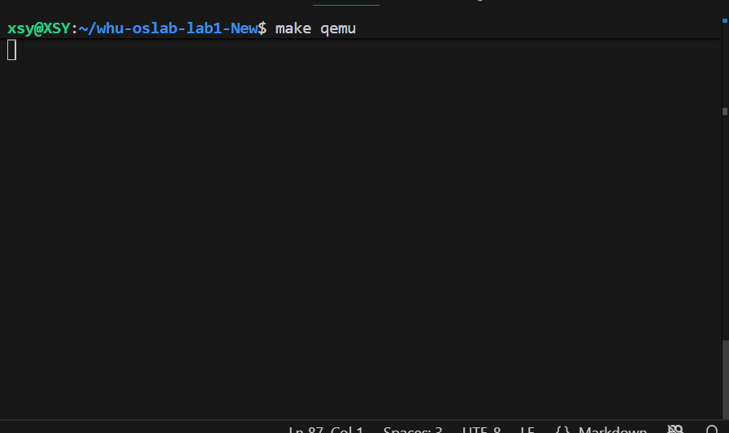
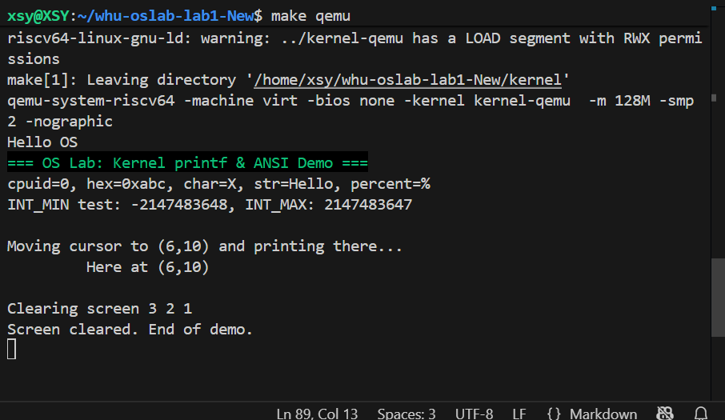
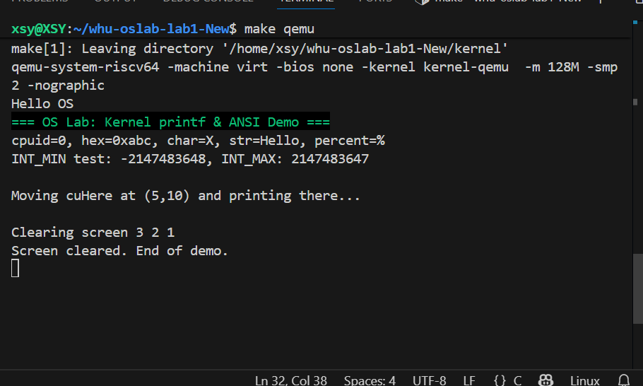

# 实验报告：Lab1 —— 添加内核 printf 与清屏功能实现

## 一、实验目的

1. 理解操作系统内核为什么必须自己实现基本的输出功能（如 `printf` 和清屏）。  
2. 掌握内核中 `printf` 的设计方法，包括格式解析、数字转换和字符串输出。  
3. 了解 BSS 段清零的重要性，以及启动阶段的最小输出环境搭建。  
4. 通过实现清屏与定位功能，熟悉 ANSI 转义序列或显存写入机制。  
5. 完成综合测试与优化，思考性能瓶颈和改进方向。

## 二、实验环境及框架

### 1. 实验环境
- 开发平台：Ubuntu 24.04 + RISC-V 工具链 (`riscv64-linux-gnu-gcc`)  
- 模拟器：QEMU (`qemu-system-riscv64 -machine virt -nographic`)  

### 2. 代码框架

whu-oslab-lab1-new
├── include
│   ├── uart.h
│   ├── lib
│   │   ├── print.h
│   │   └── lock.h
│   ├── proc
│   │   ├── cpu.h
│   │   └── proc.h
│   ├── common.h
│   ├── memlayout.h
│   └── riscv.h
├── kernel
│   ├── boot
│   │   ├── main.c   <!-- TODO -->
│   │   ├── start.c  <!-- TODO -->
│   │   ├── entry.S
│   │   └── Makefile
│   ├── dev
│   │   ├── uart.c
│   │   └── Makefile
│   ├── lib
│   │   ├── print.c  <!-- TODO -->
│   │   ├── spinlock.c <!-- TODO -->
│   │   └── Makefile
│   ├── proc
│   │   ├── pro.c    <!-- TODO -->
│   │   └── Makefile
│   ├── Makefile
│   └── kernel.ld
├── picture
│   └── *.png
├── Makefile
├── common.mk
├── README.md
└── Report.md

## 三、实验内容与实现

### 1. 内核最小输出环境

- UART 驱动：实现 `uart_putc_sync`，保证字符能稳定发送到串口。  
- BSS 清零：在启动汇编 `entry.S` 中，使用链接脚本导出的 `edata/end` 清空全局变量区。  
- 多核栈设置：每个 hart 分配独立的 4 KiB 栈，避免并发冲突。

### 2. `printf` 的实现

- **支持的格式**：`%d`、`%x`/`%p`、`%s`、`%c`、`%%`。  
- **数字转换**：非递归除法取余，避免栈过深，同时支持负数和 `INT_MIN`。  
- **字符串输出**：空指针自动转为 `"(null)"`。  
- **并发安全**：通过自旋锁 `spinlock` 保护，保证多核同时输出不交错。  

### 3. 清屏与控制

基于 ANSI 转义序列实现：

- `clear_screen()` → `ESC[2J ESC[H` 清屏并复位光标。  
- `goto_xy(row,col)` → `ESC[row;colH` 定位光标。  
- `set_color(fg,bg)` / `reset_color()` → 修改前景/背景色。  

### 4. 综合测试

在 `start.c` 的主核中演示：

clear_screen(); //清屏
set_color(2, -1);  // 绿色文字
printf("=== Kernel printf & ANSI Demo ===\n");
reset_color(); //重置颜色
printf("INT_MIN test: %d, INT_MAX: %d\n", (int)0x80000000, (int)0x7fffffff); //测试边界条件
printf("cpuid=%d, hex=0x%x, str=%s, char=%c\n", mycpuid(), 0xabc, "Hello", 'X');
goto_xy(6, 10); //光标移动
printf("Here at (6,10)\n");

### 5. 测试结果

输入make qemu后成功显示出清屏的功能：
向上滑动查看终端历史输出记录：
我们可以清楚地看到字体颜色发生了改变，输出了一段绿色的字符串。另外，边界测试结果也成功输出。

## 四、测试与优化

### 功能测试
- 单字符、整数字符串、特殊符号 `%`。  
- 边界条件：`INT_MIN`、`NULL` 字符串。  

### 性能测试
- 大量循环输出字符串，检查是否死锁、是否丢字符。  

### 优化思路
- **批量输出**：把字符串先缓存在临时数组中，一次性写 UART FIFO。  
- **查表优化**：十六进制转换可用预定义查表。  
- **格式解析优化**：简单场景下可用有限状态机代替复杂 switch。

## 五、调试方法

1. **分模块调试**：  
   - 先测单字符输出  
   - 再测数字转换  
   - 再测字符串处理  
   - 最后综合格式串  

2. **错误恢复**：  
   - 遇到未知格式，直接原样输出 `%x`，保证内核不会崩溃。  
   - UART 初始化失败 → `panic("uart init failed")`。

## 六、思考题回答

1. 为什么内核要自己实现 printf？
因为在内核启动或出错时，用户态和标准库尚未建立，必须有最小的输出机制用于调试和诊断。此外，内核需要直接控制硬件（如 UART、显存），而用户态 printf 依赖于系统调用，这在早期启动阶段是不可用的。

2. 为什么需要清屏？
避免多次输出堆叠影响观察，尤其是教学/调试时更直观。此外，清屏功能也是实现更复杂交互界面的基础，如菜单系统、日志查看器等。

3. 架构设计：为什么分层？
驱动层（UART）只负责单字符输入/输出；上层（print.c）实现格式化；调用层（start.c）演示逻辑。这种分层便于替换或扩展输出设备（如 VGA）。分层还使得代码更易于测试和维护，每一层职责明确，耦合度低。

4. 算法选择：数字转字符串不用递归的原因及不用除法实现进制转换
- 避免早期内核栈消耗过大，同时迭代实现效率更高。递归在栈空间有限的内核环境中容易导致栈溢出，且递归调用开销较大，不适合内核这种对性能和安全要求高的环境。
- 可以使用查表法或减法替代法（通过重复减法模拟除法运算，统计减法的次数作为商，剩余数作为余数。）

5. 性能优化：瓶颈与改进？
瓶颈主要在循环调用 uart_putc_sync；改进方向是引入缓冲区、批量写、甚至中断驱动。此外，可以针对常用输出路径（如整数输出）进行内联优化，减少函数调用开销。

6. 错误处理策略
printf遇到空指针的时候我在代码里先判断，后面直接输出字符串`NULL`。格式字符串出错时遇到未定义的字符直接输出。如下：
` if (!s) //s为空，输出NUll`
`   s = "(null)";`
` while (*s) //否则，逐字符输出字符串`
`   print_putc(*s++);`

## 七、出现的问题及解决思路

1. 数字转换错误（如负数显示为正数）——在原来的print_number中未处理负数情况（直接使用无符号数转换），INT_MIN 转换时溢出（-INT_MIN 仍为负数）后来在 print_number 中先判断符号，转为正数处理；INT_MIN 特殊处理，直接硬编码输出

2. 清屏或光标定位无效——后来检查发现是转义序列格式错误（如缺少 `[ `或使用错误参数），使用标准转义序列。

3. 光标跳转后覆盖原有输出——在检查输出时，我发现原来的`Moving cursor to (6,10) and printing there...`这段输出被后面的输出覆盖。仔细排查后发现这是由于光标移动的位置刚好在那个字符串输出的位置上，将其移动位置改为（6，10）就避免了覆盖。

## 八、实验总结

通过本章实验，我掌握了以下要点：

- 如何在内核早期搭建最小输出环境；  
- 如何用 C 实现一个轻量级 `printf`；  
- 为什么 BSS 清零、锁保护、ANSI 转义序列在实验中很重要；  
- 在实现过程中，逐步调试、分层设计是保证正确性的关键。  

本实验为我后续进程调度和系统调用实验提供了必要的调试工具，也加深了我对内核开发中输出系统设计的理解。
