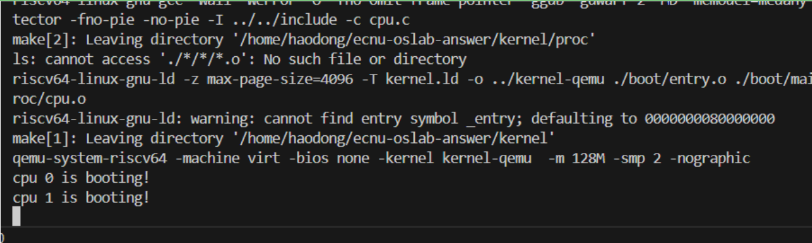

# LAB-1: 机器启动

## 组织结构
## 代码组织结构

ECNU-OSLAB  
├── include  
│   │   └── uart.h  
│   ├── lib  
│   │   ├── print.h  
│   │   └── lock.h  
│   ├── proc  
│   │   └── cpu.h  
│   ├── common.h  
│   ├── memlayout.h  
│   └── riscv.h  
├── kernel  
│   ├── boot  
│   │   ├── main.c  (TODO)  
│   │   ├── start.c (TODO)   
│   │   ├── entry.S  
│   │   └── Makefile  
│   ├── dev  
│   │   ├── uart.c  
│   │   └── Makefile  
│   ├── lib  
│   │   ├── print.c (TODO)  
│   │   ├── spinlock.c (TODO)  
│   │   └── Makefile    
│   ├── proc  
│   │   ├── cpu.c  (TODO)  
│   │   └── Makefile  
│   ├── Makefile  
│   └── kernel.ld  
├── Makefile  
└── common.mk  

## 核心目标

完成双核的机器启动，能够进入main函数并输出一些东西 (如下图)  

  

## 具体任务

要想实现上述核心目标，仔细想想只需要搞定两件事  

1. 把代码在qemu上跑起来（双核启动），从 **entry.S** 到 **start.c** 到 **main.c**  

2. 向我们的屏幕输出一些字符串，也就是实现我们经常调用的 **printf**

第一件事需要你研究一下xv6的启动流程，只需要看到进入 **main.c** 就够了，比较简单  

第二件事需要你先阅读一下 **uart.c**，里面包括uart的驱动，实现了最基本的字符读写功能  

读完之后你需要利用uart层的函数完成 **print.c** 中的函数，你可以参考xv6的实现，也可以自己去做  

此外，你还需要实现 **spinlock.c** 里的函数，自旋锁是最基本最常用的同步手段  

它的实现依赖于**开关中断**和**原子操作**这两个概念，你需要完全理解  

之所以需要实现自旋锁，是因为`printf`的本质是很多独立的`uart_putc_sync`操作  

没有锁的保护，会出现并行执行的`printf`操作抢占`uart`资源,导致输出混乱的情况  

完成这些事情后，你应当可以实现上面图片所示的效果 (在**main.c**的合适位置输出这两句话)  

## 额外任务

这里有额外的两个小实验帮助你理解锁的用处:  

### 1. 并行加法计算

``` 
    #include "riscv.h"
    #include "lib/print.h"

    volatile static int started = 0;

    volatile static int sum = 0;

    int main()
    {
        int cpuid = r_tp();
        if(cpuid == 0) {
            print_init();
            printf("cpu %d is booting!\n", cpuid);        
            __sync_synchronize();
            started = 1;
            for(int i = 0; i < 1000000; i++)
                sum++;
            printf("cpu %d report: sum = %d\n", cpuid, sum);
        } else {
            while(started == 0);
            __sync_synchronize();
            printf("cpu %d is booting!\n", cpuid);
            for(int i = 0; i < 1000000; i++)
                sum++;
            printf("cpu %d report: sum = %d\n", cpuid, sum);
        }   
        while (1);    
    }  
```

在 **main.c** 中测试上述代码，很明显，我们的预期是后report的cpu应该告诉我们 **sum = 2000000**  

但是实际结果可能是这样的  

```
cpu 0 is booting!
cpu 1 is booting!
cpu 0 report: sum = 1128497
cpu 1 report: sum = 1143332
```

考虑如何使用锁进行修正，给出修正后的代码，修正后的输出可能是这样的  

```
cpu 0 is booting!
cpu 1 is booting!
cpu 0 report: sum = 1996573
cpu 1 report: sum = 2000000
```

简单说明上锁和解锁的位置不同会有什么影响（tips: 锁的粒度粗细）

### 2. 并行输出  

尝试去掉`printf`里的锁，按照前一个实验的思路，设计测试方法使得`printf`的输出出现交错的情况  

给出你在main.c里的测试代码和结果截图  

注意，额外任务完成后**复原你的代码**，额外任务的结果只需要在markdown文档中体现即可  

## 提交作业

1. 每次实验需要在上次实验的基础上继续往下做，假设你已经完成Lab-0

    那么你此时应该在Lab-0的分支下使用 `git checkout -b Lab-1`命令创建并切换到新的分支Lab-1  

    此时新建的Lab-1会继承Lab-0的内容，你对Lab-1的修改不会影响到Lab-0  

    以此类推，当你从Lab-0一步步走到Lab-n时，你会获得越来越完整强大的内核  

2. 每次作业都由 **代码+Markdown文档** 两部分构成  

    文档内容不做明确要求，你有很高的自由度决定写什么和写多少  

    提供一些建议: 这次实验新增了哪些功能，实现了什么效果，回答实验中提出的问题  

    对某个过程的详细理解（比如这次实验的xv6启动过程, Makefile中的make qemu是怎样工作的）  

    注意使用markdown的分层方法增加条理性，让别人可以愉快阅读和抓住重点

    总之，这是你的项目，对你自己的代码和文档负责  
    
    注意，代码是连续的但是文档不是，每次的文档不需要接着上一次的写  

3. 提醒: 之所以要求大家维护代码仓库，是为了查看大家的提交记录，  

    所以请及时同步当天写的东西到线上仓库，不要攒到最后一口气提交  

    可能被误判为复制粘贴

## 实验进展（根据PPT要求）

- [x] 启动汇编 `entry.S`：设置栈、多核支持、清零 `.bss`、跳转到 C。
- [x] 链接脚本 `kernel/kernel.ld`：起始地址 `0x80000000`，导出 `edata`/`end` 等符号。
- [x] 最小 UART 驱动：`uart_putc_sync` 支持阻塞输出。
- [x] `printf` 内核实现：支持 `%d/%x/%s/%c/%%`，处理 `INT_MIN` 边界，带自旋锁保护跨核并发。
- [x] 清屏与控制：提供 `clear_screen()`、`goto_xy(row,col)`、`set_color(fg,bg)`、`reset_color()` 基于 ANSI 序列。
- [x] 综合演示：在 `start.c` 中展示 printf、定位、清屏与颜色输出。

### 运行

```bash
make qemu           # 在根目录运行
# gdb 调试：
make qemu-gdb &
gdb-multiarch kernel-qemu -x .gdbinit.tmpl-riscv
```

### 预期输出（简化示例）

```
Hello OS
=== OS Lab: Kernel printf & ANSI Demo ===
cpuid=0, hex=0xabc, char=X, str=Hello, percent=%
INT_MIN test: -2147483648, INT_MAX: 2147483647
...
Screen cleared. End of demo.
```

> 注意：清屏和定位依赖 ANSI 序列，QEMU `-nographic` 下串口终端默认支持。
