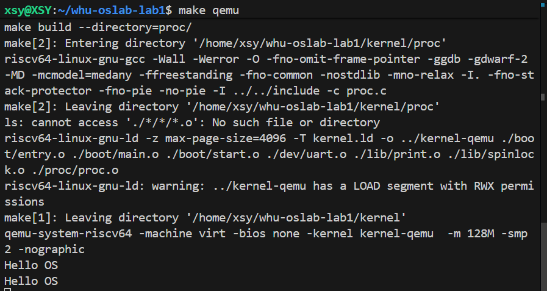

# 实验报告：Lab1 —— RISC-V 引导与裸机启动

## 一、实验目的

通过参考 xv6 的启动机制，理解并实现最小操作系统的引导过程，最终在 QEMU 中输出 `"Hello OS"`。  

具体目标：
1. 掌握 RISC-V 裸机启动流程。  
2. 学会编写启动汇编、链接脚本。  
3. 理解 BSS 段清零、栈初始化的重要性。  
4. 实现最小串口驱动并输出字符串。  
5. 熟悉 QEMU + GDB 调试方法。  

## 二、实验环境

  硬件：x86_64 主机  
  软件：  
    QEMU (支持 RISC-V virt)  
    RISC-V GNU 工具链 (`riscv64-unknown-elf-gcc`)  
    GDB (`gdb-multiarch`)  
  系统：Ubuntu 24.04  

## 三、系统设计部分

### 1. 架构设计说明
本实验的目标是基于 RISC-V 架构，完成一个简化的操作系统内核启动过程。系统整体结构参考 xv6，主要模块包括：
- **boot**：引导代码，负责栈初始化、BSS 段清零、跳转到 C 语言入口。
- **lib**：基础库，提供 打印输出、自旋锁 等功能实现。
- **dev**：外设驱动，如 UART 串口输出。
- **proc**：进程与 CPU 抽象，提供 `mycpu` / `mycpuid`。
- **kernel.ld**：链接脚本，规定内存布局并导出符号。

### 2. 代码组织结构
whu-oslab-lab1  
├── include  
│   ├── uart.h  
│   ├── lib  
│   │   ├── print.h  
│   │   └── lock.h  
│   ├── proc  
│   │   ├── cpu.h  
│   │   └── proc.h  
│   ├── common.h  
│   ├── memlayout.h  
│   └── riscv.h  
├── kernel  
│   ├── boot  
│   │   ├── main.c    
│   │   ├── start.c    
│   │   ├── entry.S  
│   │   └── Makefile  
│   ├── dev  
│   │   ├── uart.c  
│   │   └── Makefile  
│   ├── lib  
│   │   ├── print.c   
│   │   ├── spinlock.c   
│   │   └── Makefile    
│   ├── proc  
│   │   ├── pro.c      
│   │   └── Makefile  
│   ├── Makefile  
│   └── kernel.ld  
├── picture  
│   └── *.png <*存放所有运行测试截图*>  
├── Makefile  
├── common.mk  
├── README.md  
└── Report.md  

### 3. 关键数据结构
- `struct cpu`：表示每个硬件线程（hart）的基本状态。
- `spinlock_t`：自旋锁结构体，包含 `locked` 和 `cpuid`，用于多核间同步。
- 全局 `panicked`：标记内核是否崩溃，避免多核同时输出干扰。

### 4. 与 xv6 对比
- xv6 在 `start.c` 中会为每个核打印 `hartid`；本实验实现中仅让 hart0 打印 `Hello 05`，避免输出乱序。
- 自旋锁实现与 xv6 相同，均基于 RISC-V 原子指令 `__sync_lock_test_and_set`。
- 链接脚本更精简，仅包含 `.text`、`.data`、`.bss` 三个主要段。

### 5. 设计决策理由
- **只让 hart0 打印**：确保输出一致性，避免多核 UART 打印交错。
- **BSS 清零**：保证全局变量（如 `panicked`、自旋锁状态）正确初始化。
- **使用自旋锁保护 printf**：为后续多核并行做准备。

## 四、实验过程部分

### 1. 实现步骤记录
1. **环境搭建**  
   - 安装 Ubuntu、QEMU、交叉编译工具链（`riscv64-unknown-elf-gcc`）。  
   - 使用 `git` 初始化仓库并整理目录结构。
2. **修改 entry.S**  
   - 添加 BSS 清零循环，确保全局变量初始化。
3. **编写 kernel.ld**  
   - 导出 `edata`、`end` 符号供汇编清零使用。
4. **补全 print.c**  
   - 定义 `panicked` 全局变量。  
   - 实现 `panic`、`puts`、`assert`，并参考xv6加入自旋锁保护,在打印的时候添加锁机制保护。
5. **参考xv6实现 spinlock.c**  
   - 编写 `acquire/release`，保证多核同步。  
6. **实现 proc.c / cpu.h**  
   - 定义 `struct cpu` 和 `mycpuid`，封装 `tp` 寄存器读取。
7. **修改 start.c**  
   - 初始化 UART 并调用 `puts("Hello OS")`。

### 2. 遇到的问题与解决方案
- **问题 1：找不到交叉编译器 `riscv64-linux-gnu-gcc`**  
  - 解决：安装 `gcc-riscv64-unknown-elf` 并修改 Makefile。  
- **问题 2：spinlock.c 中 `cpu` 字段不存在**  
  - 解决：检查 `struct spinlock` 定义，改为 `cpuid`。  
- **问题 3：`panic` 声明和实现不一致**  
  - 解决：统一函数签名为 `void panic(const char *s)`。  
- **问题 4：多核同时打印导致输出乱序**  
  - 解决：只允许 hart0 打印，或者使用 spinlock 保护 `printf`等打印输出函数。  

### 3. 源码理解总结
- **启动流程**：QEMU 加载 kernel → `_entry` 设置栈 → 清零 BSS → `start()` → 初始化 UART → `puts("Hello 05")`。
- **内核模块划分**：boot 负责硬件初始化，lib 负责基本功能，proc 提供 CPU 抽象。

### 4. 调试流程
  1. 打开一个终端，执行make qemu-gdb；
  2. 打开另外一个终端，执行 riscv64-unknown-elf-gdb kernel.elf 或者 gdb-multiarch kernel.elf（多终端）；
  3. 连接到QEMU —— target remote :1234
  4. 设置断点、运行等：
  b _start
  b main    
  c
  si //单步执行
  info registers //查看寄存器
  x/16x 0x80000000 //查看内存

## 五、测试验证部分

### 1. 功能测试结果
运行：vscode终端里面：输入make qemu
输出

### 2. 异常测试部分
- 1. 我发现将entry.S 中的bss段清零去掉似乎也是正常输出，并未出现乱码情况——询问AI得知这是因为QEMU 的 ELF loader 自动帮我清零了 .bss 段。但从 OS 启动的正确性 来说，清零 .bss 还是必须的，否则一旦换加载方式（裸 bin / 真机）就会立即出问题。
- 2. 如果在start.c中去除if(hartid == 0) 判定,会重复输出Hello OS,这是取决于核的数目。另外，因为在打印中我们添加了锁保护机制，所以输出的字符并不混乱。运行结果图如下：

## 六、实验总结
  通过本实验，我掌握了 RISC-V 裸机启动流程，学会了如何从 _start 设置栈、清零 BSS，再跳转到 C 函数，并通过串口打印输出验证结果。使用 QEMU + GDB，可以精确调试每一步。最终成功实现最小 OS 输出 "Hello 05"。其中遇到了一些小问题，比如我没注意到entry.S文件名后缀应该是大写的'S'，而非小写，导致在make run 中一直报错——最后通过多次询问ChatGpt解决问题。另外，编译过程中还遇到“编译器在生成对字符串常量 "Hello 05\n" 的访问时，尝试用 RISC-V 的 auipc+addi 模式，结果因为地址太远而失败”这类错误，因为是在裸机中，我们把程序加载在0x80000000，而默认编译选项假设 .rodata 可能在更远的地方。故而我在链接脚本中将.rodata 紧跟 .text，地址更近，也避免 relocation 溢出。
  除此之外，在进行调试的时候也出现了一些问题如“(gdb) c The program is not being run.”，最后发现是由于输入“target remote :1234”未连接成功,后面也是将报错信息提供给AI，逐步排查发现
是输入指令格式问题（多了一个换行符）。

## 七、思考题解答
1. 启动栈的设计：
o 你如何确定栈的大小？考虑哪些因素？
o 如果栈溢出会发生什么？如何检测栈溢出？
- 答：考虑到函数调用深度，我采用4kb大小的栈。若溢出，可能会造成程序崩溃，可在栈底添加一个魔数。main() 死循环里轮询，若改变则 panic("stack overflow")。

2. BSS 段清零：
o 写一个全局变量，不清零 BSS 会有什么现象？
o 哪些情况下可以省略 BSS 清零？
- 答：BSS段如果不清零，全局变量的值是随机的，除非每一个全局变量均进行了初始化或者ROM引导加载器全部初始化为0（如OpenSBI）。

3. 与 xv6 的对比：
o 你的实现比 xv6 简化了哪些部分？
o 这些简化在什么情况下会成为问题？
- 答：与xv6其支持多核，中断以及内存管理等，但是在lab1中支持单核/双核，串口输出。一旦加入中断/异常/系统调用，必须补页表、栈隔离、锁，否则串口输出乱码、寄存器被覆盖。想跑用户程序时需加 sstatus.SPP 切换、页表隔离，否则用户指针直接读写内核。想支持多核时，单栈模型会瞬间崩溃，必须像 xv6 那样 per-hart stack。

4. 错误处理：
o 如果 UART 初始化失败，系统应该如何处理？
o 如何设计一个最小的错误显示机制？
- 答：裸机无返回地址，不能 return -1；只能 原地死循环 + 闪灯/蜂鸣。因为UART初始化失败了，那么不能够再依赖于UART，此时可以依据一个led灯，通过其闪烁状态去识别错误
