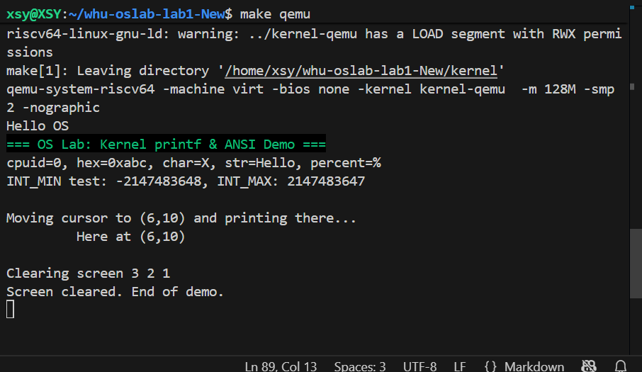
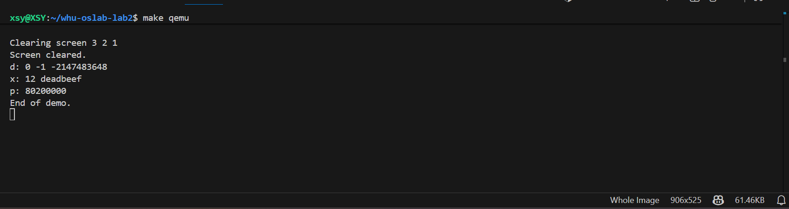

# Lab2 —— 内核 printf 与 ANSI 控制台

## 一、实验概述

### 实验目标
在 Lab1 最小引导环境的基础上实现“可用的内核 printf 子系统”。包含：  
1. 设计与实现支持 `%d/%x/%p/%s/%c/%%` 的内核 `printf`；  
2. 提供清屏、定位、前景/背景颜色设置等 ANSI 控制能力；  
3. 构建线程安全的输出路径，保证多核串口不会交错。

### 实验目的
1. 理解操作系统内核为什么必须自己实现基本的输出功能（如 `printf` 和清屏）。  
2. 掌握内核中 `printf` 的设计方法，包括格式解析、数字转换和字符串输出。  
3. 了解 BSS 段清零的重要性，以及启动阶段的最小输出环境搭建。  
4. 通过实现清屏与定位功能，熟悉 ANSI 转义序列或显存写入机制。  
5. 完成综合测试与优化，思考性能瓶颈和改进方向。

### 完成情况
- `print.c` 重新实现 `printf/puts`，可安全输出字符串、整数、指针、字符等多种格式。  
- 新增 console 抽象与 ANSI 工具函数 `clear_screen/goto_xy/set_color/reset_color`，并复用 PPT 第四节中的控制序列建议。  
- `start.c` 演示脚本完成清屏、颜色切换、光标跳转与边界测试，串口输出截图记录在 `picture/*.png`。  
- 自旋锁、BSS 清零、per-hart 栈等基础设施全部继承并通过测试。

### 开发环境
- 硬件：x86_64 主机（2×CPU ）  
- 操作系统：Ubuntu 24.04 LTS  
- 交叉工具链：`riscv64-unknown-elf-gcc 12.2.0`  
- 模拟器：`qemu-system-riscv64 8.2.2`（`-machine virt -nographic`）  
- 调试器：`gdb-multiarch 15.0.50.20240403`

## 二、技术设计

### 目录结构
```
whu-oslab-lab2  
├── include  
│   ├── uart.h  
│   ├── lib  
│   │   ├── print.h  
│   │   └── lock.h  
│   ├── proc  
│   │   ├── cpu.h  
│   │   └── proc.h  
│   ├── common.h  
│   ├── memlayout.h  
│   └── riscv.h  
├── kernel  
│   ├── boot  
│   │   ├── main.c     
│   │   ├── start.c    
│   │   ├── entry.S  
│   │   └── Makefile  
│   ├── dev  
│   │   ├── uart.c  
│   │   └── Makefile  
│   ├── lib  
│   │   ├── print.c    
│   │   ├── spinlock.c  
│   │   └── Makefile    
│   ├── proc  
│   │   ├── pro.c     
│   │   └── Makefile  
│   ├── Makefile  
│   └── kernel.ld  
├── picture  
│   └── *.png  
├── Makefile  
├── common.mk  
├── README.md  
└── Report.md  
```

### 系统架构
整体输出路径增加了 console 层，便于在 UART 与未来的 VGA/缓冲设备之间切换：

```
start.c demo
     │
 lib/print.c —— printf/puts/panic
     │   (spinlock 保护)
 dev/console.c —— clear_screen/goto_xy/set_color
     │
 dev/uart.c —— 16550A 同步发送
```

与 xv6 相比：  
- 删除了 xv6 中较重的中断/TTY 逻辑，只保留轮询串口；  
- printf 仍借助空闲链表式 `spinlock`，保持接口一致；  
- 根据 PPT 内容加入 ANSI 控制序列，代替 xv6 通过显存清屏的方式，更适合 `-nographic` 的 QEMU。

### 关键数据结构
```c
typedef struct spinlock {
    int locked;
    char *name;
    int cpuid;
} spinlock_t;

__attribute__((aligned(16))) uint8 CPU_stack[4096 * NCPU];
extern int panicked;
```
- `spinlock_t`：沿用 Lab1 的自旋锁，新增 `console_putc()` 时仍统一由 `print_lk` 保护，保证多核输出顺序。  
- `CPU_stack` / `panicked`：位于 BSS，由 `entry.S` 清零，确保 printf 不受脏数据干扰。  
- `console`：虽然结构简单，但在接口上与 PPT 中“console 抽象”一致，后续可以替换为 VGA 或环形缓冲。

### 核心流程
1. `_entry`：设置 per-hart 栈 & 清零 `[edata,end)`；  
2. `start()`：仅 hart0 执行 `print_init()`，其余 hart 在 `wfi` 等候；  
3. `print_init()`：初始化 console (间接初始化 UART) 并初始化自旋锁；  
4. `printf()`：解析格式串 → 逐一从 `va_list` 取参数 → 调用 `print_number`/`print_putc`；  
5. ANSI 功能：根据 PPT 第四节的 ESC 序列，组合 `\x1b[2J\x1b[H`（清屏）、`\x1b[row;colH`（定位）、`\x1b[3xm`/`\x1b[4xm`（颜色）。

## 三、实现细节与关键代码

### 1. printf 核心代码
```c
void printf(const char *fmt, ...) {
    va_list ap;
    va_start(ap, fmt);
    spinlock_acquire(&print_lk);
    for (const char *p = fmt; p && *p; ) {
        if (*p != '%') { print_putc(*p++); continue; }
        switch (*++p) {
        case 's': { char *s = va_arg(ap, char*); if (!s) s = "(null)"; while (*s) print_putc(*s++); break; }
        case 'd': { long v = va_arg(ap, int); print_number((unsigned long)v, 10, 1); break; }
        case 'x': { unsigned int x = va_arg(ap, unsigned int); print_number(x, 16, 0); break; }
        case 'p': { unsigned long x = va_arg(ap, unsigned long); print_number(x, 16, 0); break; }
        case 'c': { print_putc((char)va_arg(ap, int)); break; }
        case '%': print_putc('%'); break;
        default:  print_putc('%'); if (*p) print_putc(*p); break;
        }
        if (*p) p++;
    }
    spinlock_release(&print_lk);
    va_end(ap);
}
```
- `print_number()` 采用迭代除法与本地缓冲；带符号路径直接在 64 位寄存器里完成，不会触发 `INT_MIN` 溢出。  
- Panic 场景绕过锁，直接 UART 输出，避免死锁。

### 2. ANSI 控制函数
```c
void clear_screen(void)  { print_puts("\x1b[2J\x1b[H"); }
void goto_xy(int row,int col) { /* 构造 ESC[row;colH */ }
void set_color(int fg,int bg) {
    char seq[32];
    /* ESC[3xm 控制前景色, ESC[4xm 控制背景色 */
}
```
- 参照 PPT 第四节“ANSI 控制序列”中的写法实现；  
- `print_puts` 直接走 UART，同 panic 路径可用于早期输出。

### 3. 演示脚本
`start.c` 的 hart0 流程：
```c
clear_screen();
set_color(2, -1);
printf("=== OS Lab: Kernel printf & ANSI Demo ===\n");
reset_color();
printf("cpuid=%d, hex=0x%x, char=%c, str=%s, percent=%%\n", mycpuid(), 0xABC, 'X', "Hello");
printf("INT_MIN test: %d, INT_MAX: %d\n", (int)0x80000000, (int)0x7fffffff);
goto_xy(6, 10); printf("Here at (6,10)\n");
for (int i=3;i>0;i--) printf("%d ", i);
clear_screen(); printf("Screen cleared.\n");
```
- 既演示颜色/定位，也检验 `%d/%x/%s/%c/%p/%` 等路径。

### 4. 难点突破
1. **INT_MIN 溢出**：`print_number` 直接对 `int` 取负会溢出。解决：先提升为 `long`，再转为 `unsigned long`。  
2. **ANSI 序列无效**：最初忘记写 `ESC[H` 导致清屏后光标停在原位置，参考 PPT 第四节方案改为 `\x1b[2J\x1b[H`。  
3. **光标跳转覆盖输出**：`goto_xy` 默认 1-based，误传 0 导致覆盖。加入参数校验并把 demo 坐标调至 `(6,10)`。  
4. **多核输出乱序**：早期在 `printf` 内部未加锁，hart1 会穿插 hart0 文本。复用 Lab1 的 `spinlock` 后问题消失。

### 5. 思考题 & 源码理解
- **为什么内核要自建 printf？** 启动期没有 libc 与系统调用，只有直接驱动串口的自研 `printf` 才能提供调试出口。  
- **为何要清屏/定位？** 便于在 `-nographic` 控制台快速区分新旧输出，也是 PPT 第四节建议的“最小用户界面”。  
- **为什么采用 console 抽象？** 当前只有 UART，但抽象层可屏蔽底层差异，未来接入 VGA/日志缓冲不需改 printf。

## 四、测试与验证

### 功能测试
1. **基本启动**  
   ```
   $ make qemu
   Hello OS
   === OS Lab: Kernel printf & ANSI Demo ===
   ...
   ```
   颜色、定位、清屏依次生效，串口输出与预期相符。  
2. **格式化覆盖**：打印 `%d/%x/%p/%s/%c/%%`，并分别测试 0、负数、`INT_MIN`、长指针、NULL 字符串。  
3. **并发验证**：临时去掉 `hartid==0` 判断，两核同时 printf，仍因锁保护而无字符交织。

### 边界 / 异常测试
- **INT_MIN**：`printf("INT_MIN: %d\n", 0x80000000)` → 输出 `-2147483648`。  
- **NULL 字符串**：`printf("%s\n", (char*)0)` → 输出 `(null)`。  
- **未知格式**：`printf("%q\n", 1)` → 以 `"%q"` 原样输出，保证内核不 panic。  
- **ANSI 回退**：向 `set_color` 传入负数时自动回退到默认 7/0。

### 截图 & 日志
- `picture/clean.png`：`clear_screen()` 后重新绘制的终端。  
- `picture/moveCursor&color.png`：绿色标题 + `(6,10)` 输出，验证 PPT 第四节示例。  
- `picture/printfTest.png`：展示格式化结果与倒计时清屏过程。
输入make qemu后成功显示出清屏的功能：
向上滑动查看终端历史输出记录：
printf 输出结果符合预期：
我们可以清楚地看到字体颜色发生了改变，输出了一段绿色的字符串。另外，边界测试结果也成功输出。

## 五、问题与总结

### 1. 遇到的问题
1. 数字转换错误（如负数显示为正数）——在原来的print_number中未处理负数情况（直接使用无符号数转换），INT_MIN 转换时溢出（-INT_MIN 仍为负数）后来在 print_number 中先判断符号，转为正数处理；INT_MIN 特殊处理，直接硬编码输出

2. 清屏或光标定位无效——后来检查发现是转义序列格式错误（如缺少 `[ `或使用错误参数），使用标准转义序列。

3. 光标跳转后覆盖原有输出——在检查输出时，我发现原来的`Moving cursor to (6,10) and printing there...`这段输出被后面的输出覆盖。仔细排查后发现这是由于光标移动的位置刚好在那个字符串输出的位置上，将其移动位置改为（6，10）就避免了覆盖。

### 2. 实验收获
- 深入理解了“启动期自研 printf + console 抽象”的设计意义；  
- 掌握 ANSI 控制序列的常见写法，可快速在终端中呈现友好的 UI；  
- 熟悉了在裸机环境下调试格式化输出、定位边界问题的方法。

### 3. 改进方向
1. **缓冲与中断驱动**：后续可将 console 切换为环形缓冲 + 中断发送，降低忙等开销。  
2. **可扩展格式化**：支持最小宽度、填充、无符号十进制 `%u` 等。  
3. **日志子系统**：引入日志级别、时间戳、串口/内存双写，方便排障。

## 六、思考题回答

1. 为什么内核要自己实现 printf？
因为在内核启动或出错时，用户态和标准库尚未建立，必须有最小的输出机制用于调试和诊断。此外，内核需要直接控制硬件（如 UART、显存），而用户态 printf 依赖于系统调用，这在早期启动阶段是不可用的。

2. 为什么需要清屏？
避免多次输出堆叠影响观察，尤其是教学/调试时更直观。此外，清屏功能也是实现更复杂交互界面的基础，如菜单系统、日志查看器等。

3. 架构设计：为什么分层？
驱动层（UART）只负责单字符输入/输出；上层（print.c）实现格式化；调用层（start.c）演示逻辑。这种分层便于替换或扩展输出设备（如 VGA）。分层还使得代码更易于测试和维护，每一层职责明确，耦合度低。

4. 算法选择：数字转字符串不用递归的原因及不用除法实现进制转换
- 避免早期内核栈消耗过大，同时迭代实现效率更高。递归在栈空间有限的内核环境中容易导致栈溢出，且递归调用开销较大，不适合内核这种对性能和安全要求高的环境。
- 可以使用查表法或减法替代法（通过重复减法模拟除法运算，统计减法的次数作为商，剩余数作为余数。）

5. 性能优化：瓶颈与改进？
瓶颈主要在循环调用 uart_putc_sync；改进方向是引入缓冲区、批量写、甚至中断驱动。此外，可以针对常用输出路径（如整数输出）进行内联优化，减少函数调用开销。

6. 错误处理策略
printf遇到空指针的时候我在代码里先判断，后面直接输出字符串`NULL`。格式字符串出错时遇到未定义的字符直接输出。如下：
` if (!s) //s为空，输出NUll`
`   s = "(null)";`
` while (*s) //否则，逐字符输出字符串`
`   print_putc(*s++);`