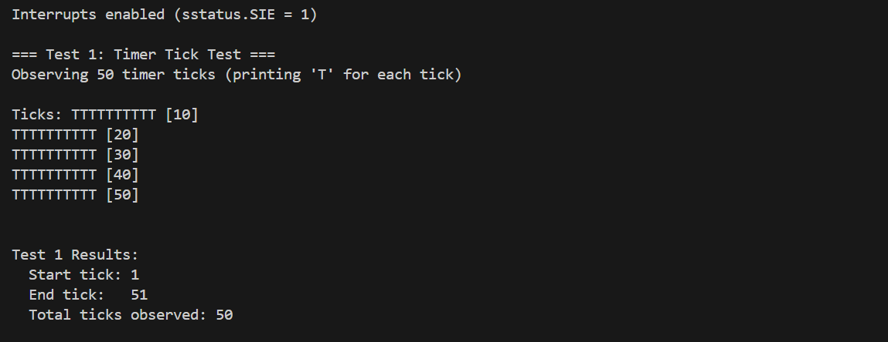
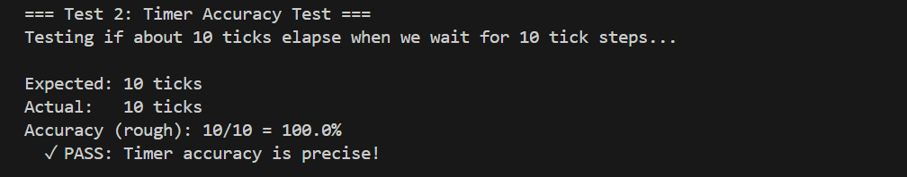
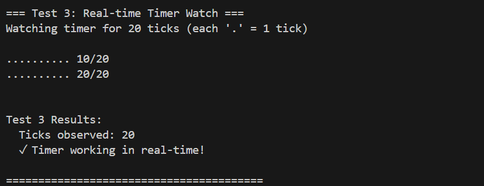
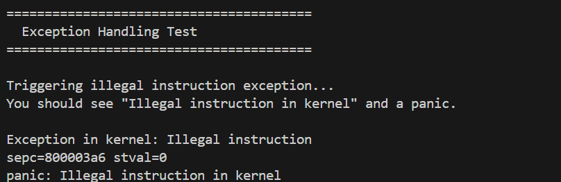
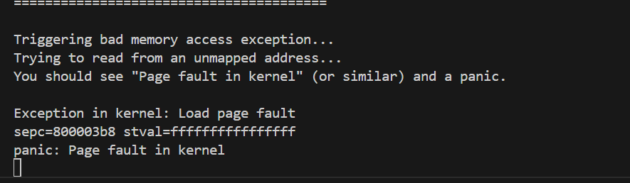
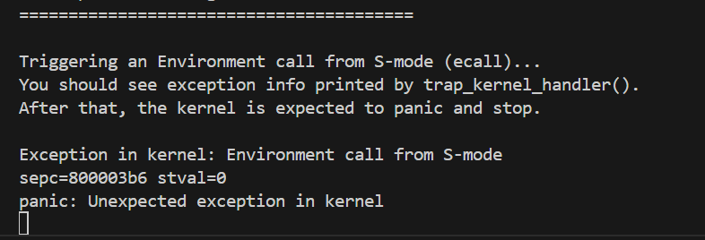
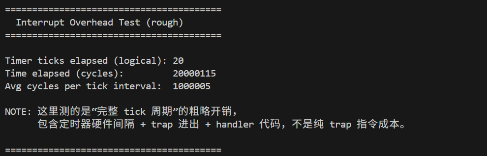
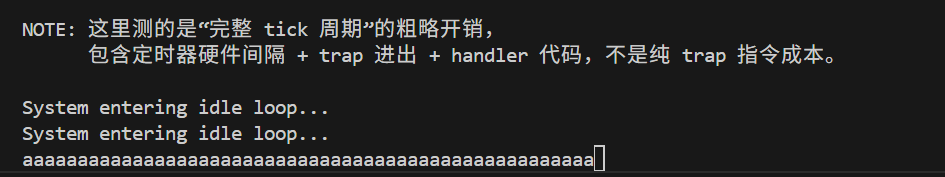

# 综合实验报告：Lab4 —— 中断与时钟管理

> **实验目标**：构建 RISC-V 平台上完整的中断处理与时钟管理链路，涵盖 M/S 模式委托、trap 框架、外设中断分发与周期性调度时钟，为后续进程调度与系统调用打下基础。

## 一、实验概述

### 实验目标
在 Lab3 运行态基础上，补齐“中断—trap—驱动”全栈链路，使得 RISC-V 平台可以正确处理 M/S 模式下的时钟和外设中断、输出调试日志，并为后续调度/系统调用提供定时器与异常框架。

### 完成情况
- 配置 `medeleg/mideleg`、`mie/sie`、PLIC 阈值等寄存器，实现 Machine→Supervisor trap 委托；
- 实现 `kernel_vector`/`timer_vector` 与 `trap_kernel_handler()`，可区分时钟、外设与异常；
- 搭建 IRQ 注册与 enable/disable API，UART 中断与回显工作正常；
- 新增 `timer_update()`/`timer_get_ticks()`，通过多项测试验证精度与性能；
- 可进一步补充的方向：将 `timer_interrupt_handler()` 中的调度钩子替换为真正的进程调度逻辑，并扩展更多 PLIC 设备。

### 开发环境
- 硬件：x86_64 主机（QEMU virt）
- 操作系统：Ubuntu 24.04 LTS
- 工具链：`riscv64-unknown-elf-gcc 12.2.0`、`gdb-multiarch 15.0.50.20240403`
- 模拟器：`qemu-system-riscv64 8.2.2 -machine virt -nographic`
- 调试方式：`make qemu-gdb` + `gdb-multiarch kernel.elf`

---

## 系统设计部分

### 架构设计说明
- **引导阶段（`kernel/boot/start.c`）**：在 M-mode 中设置 `mideleg`/`medeleg`、`mie`/`sie` 以及 PMP，调用 `timer_init()` 完成 CLINT 初始化，然后通过 `mret` 切换到 S-mode 并进入 `main()`。
- **Trap 框架（`kernel/trap/trap.S` + `kernel/trap/trap_kernel.c`）**：S-mode 的 `kernel_vector` 负责保存 31 个通用寄存器、调用 `trap_kernel_handler()` 并在返回前恢复寄存器，C 层根据 `scause` 将 trap 分发到时钟、外设或异常处理。M-mode 的 `timer_vector` 使用 `mscratch` 复用寄存器空间，更新 `MTIMECMP` 并通过设置 `sip.SSIP` 将时钟中断“柔性转发”到 S-mode。
- **设备抽象（`kernel/dev`）**：`timer.c` 管理全局 `timer_t`，通过自旋锁保证 `ticks` 读写原子性；`plic.c` 负责设置优先级、阈值、Claim/Complete；`uart.c` 驱动 16550 UART 并在中断到来时回显输入。
- **测试入口（`kernel/boot/main.c`）**：CPU0 完成所有全局初始化后开启中断并运行三组测试（定时器、异常、开销），其他 CPU 仅执行 `kvm_inithart()` + `trap_inithart()` + `intr_on()` 并进入空闲循环。

### 关键数据结构
- `struct trapframe`（`include/trap/trap.h`）：保存 `sepc`、`sstatus`、`scause`、`stval`，用于 C 层判断 trap 来源和后续（例如异常恢复）逻辑；寄存器内容由 `kernel_vector` 入栈，保持接口简洁。
- `interrupt_handler_t irq_table[64]`（`kernel/trap/trap_kernel.c`）：软件中断向量表，提供 `register_interrupt()`、`enable_interrupt()`、`disable_interrupt()`，使得 PLIC 外设中断可以在驱动初始化时动态注册处理函数并按需开关。
- `timer_t sys_timer`（`kernel/dev/timer.c`）：使用自旋锁保护的 `ticks` 计数器，`timer_update()` 仅在 CPU0 调用，`timer_get_ticks()` 向上层提供线程安全的查询接口。
- `mscratch[NCPU][5]`（`kernel/dev/timer.c`）+ `CPU_stack[NCPU]`（`kernel/boot/start.c`）：前者为 M-mode timer ISR 预留寄存器保存区与 `MTIMECMP`/`INTERVAL` 缓冲，后者是每个 hart 的启动栈，保证 trap 嵌套安全。

### 与 xv6 的对比
- **Trap 入口**：xv6 的 `trapframe` 在内存中长期保存所有寄存器，本实验将寄存器保存留在 `kernel_vector` 的栈帧里，只把 CSR 填入 `trapframe`，减少内存写入且实现更贴近“异常现场只读CSR”的使用场景。
- **中断分发**：xv6 直接通过 `plic_claim()` 的返回值 switch 处理；本实验将 Claim 结果进一步抽象到 IRQ 表，实现“先注册再调用”，后续只需要 `register_interrupt()` 就能挂接新的外设，降低模块耦合度。
- **时钟路径**：xv6 在 S-mode 直接调用 `sbi_set_timer()`；本实验保留 M-mode 中的 `timer_vector` 并使用 `mscratch` 更新 `MTIMECMP`，使得 S-mode 只需处理软件中断即可，符合实验要求“理解 Machine->Supervisor 委托”。

### 设计决策理由
1. **全栈分层**：M-mode 仅负责最小化的安全配置和时钟硬件访问，S-mode 负责多外设调度，符合 RISC-V 推荐实践，便于后续在 S-mode 引入分页/进程。
2. **软件可扩展**：IRQ 表 + `enable_interrupt()` API 让新设备只需注册即可生效，不必修改 trap 核心逻辑；未来支持优先级或中断嵌套时也能集中扩展。
3. **最小共享状态**：`timer_update()` 只允许 CPU0 写 `ticks`，其余 hart 只读，利用锁保障一致性。该策略避免不同核对 `MTIMECMP` 的竞争，利于快速验证。
4. **可测试性优先**：在 `main()` 中保留 `test_*` 系列函数，通过串口输出展示定时器与异常行为，避免依赖外部测试框架。

---

## 实验过程部分

### 实现步骤记录
1. **委托链路搭建**：阅读 RISC-V 特权规范 3/12 章并将 `medeleg`/`mideleg` 全部置位，S-mode 侧开启 `SIE_SEIE|SIE_STIE|SIE_SSIE`，确保时钟和外设中断能由 Supervisor Trap 接管（`kernel/boot/start.c`）。
2. **M-mode 时钟引擎**：在 `timer_init()` 中配置 `CLINT_MTIMECMP` 首次截止、初始化 `mscratch` 并设置 `mtvec=timer_vector`，保证每个 hart 均能自主刷新 `MTIMECMP`。
3. **S-mode Trap 框架**：`kernel/trap/trap.S` 中实现 `kernel_vector` Save/Restore；`trap_kernel_handler()` 读取 CSR 组装 `trapframe`，依据 `scause` 最高位区分中断/异常，分派到时钟、中断或 `handle_exception()`。
4. **外设驱动接入**：`trap_init()` 清空 `irq_table` 并注册 UART 中断；`trap_inithart()` 设置 `stvec` 与 PLIC 阈值，同时对该 hart 调用 `enable_interrupt(UART_IRQ)`。
5. **时钟/异常逻辑**：`timer_interrupt_handler()` 仅在 CPU0 调用 `timer_update()` 并预留 `yield()` 钩子；`handle_exception()` 打印 `exception_info` 并 `panic`，用于实验验证。
6. **自测工具**：在 `kernel/boot/main.c` 中实现 `test_timer_interrupt()`、`test_exception_handling()`、`test_interrupt_overhead()` 并按需启用，串口上可直接观察结果。

### 问题与解决方案
| 问题 | 现象 | 解决方案 |
| --- | --- | --- |
| M/S 委托配置不完整导致 trap 落入 M-mode | `scause` 停留在 M-mode，系统无输出 | 将 `w_mideleg(0xffff)` & `w_medeleg(0xffff)` 并在 `start()` 中开启 `SIE_*` 位，保证所有中断都可进入 S-mode。 |
| PLIC Claim 返回 0 | `external_interrupt_handler()` 进入默认分支，终端无回显 | 在 handler 中直接返回并跳过 `plic_complete(0)`，同时确认 `enable_interrupt(UART_IRQ)` 在 `trap_inithart()` 被调用。 |
| 时钟中断不断重入导致栈溢出 | 未清除 `sip.SSIP` 导致 `kernel_vector` 重入 | 在 case1 中执行 `w_sip(r_sip() & ~2)` 手动清零 SSIP，再调用 `timer_interrupt_handler()`。 |
| 触发异常后 PC 未恢复 | 未将更新后的 `sepc`/`sstatus` 写回 | 在 `trap_kernel_handler()` 末尾统一 `w_sepc(tf.sepc)`、`w_sstatus(tf.sstatus)`，如果处理过程中修改了 CSR，返回地址就会生效。 |

### 源码理解
- `kernel_vector`（汇编）做了两件事：把用户/内核的通用寄存器压栈，然后把 CSR（比如 `sepc`/`sstatus`/`scause`/`stval`）装到一个 `trapframe` 里，最后跳到 C 函数 `trap_kernel_handler()`；返回时再把寄存器恢复。也就是说，汇编负责“搬东西”，C 层负责“看东西并做决定”。

- `trap_kernel_handler()` 的工作流程很直接：先看 `scause`，分两类处理——中断（interrupt）和异常（exception）。
   - 如果是外设中断（external interrupt），会走 `external_interrupt_handler()`：它调用 `plic_claim()` 得到 IRQ 编号，然后查 `irq_table[irq]`，如果有注册的 handler 就调用，没有就打印一条“Unknown external interrupt”的提示，最后调用 `plic_complete(irq)` 完成中断。这个顺序（claim→dispatch→complete）是标准流程。
   - 如果是时钟（timer）中断，最终会走 `timer_interrupt_handler()`，而 `timer_vector`（M-mode 的入口）利用 `mscratch` 和 `MTIMECMP` 把下一次中断安排好，然后通过写 `sip.SSIP` 或相关CSR把事件转到 S-mode，由上面的流程收到并处理。

- UART 路径很简单：UART 硬件写入 RHR，UART 控制器置 pending，PLIC 上有 pending bit，S-mode 的 `external_interrupt_handler()` Claim 到 UART IRQ，查到 `uart_intr()` 并执行。`uart_intr()` 在本仓库是回显实现：读 RHR、写 THR。这种 handler 应该尽量短——长逻辑会阻塞其他中断。

- 关于并发和多核：我们把 `timer_update()` 限定为 CPU0 执行，其他 hart 只读 `ticks`，这样避免了多个 hart 同时修改 `MTIMECMP` 或全局计数带来的竞争。每个 hart 都有自己的 `mscratch` / 启动栈，避免在中断时互相干扰。

- 调试提示（遇到无中断或回显失败按顺序排查）：
   1. 确认 `uart_init()` 被调用（在 `kernel/boot/main.c` CPU0 初始化序列中）；
   2. 确认 `trap_init()` / `trap_inithart()` 已注册并使能 UART IRQ（`register_interrupt()`、`enable_interrupt(UART_IRQ)`）；
   3. 在 `external_interrupt_handler()` 临时打印 `plic_claim()` 的返回值，确认是否有 pending IRQ；
   4. 如果 Claim 返回 0，说明设备未发中断或者 PLIC/enable 位没设置；检查 UART 的 IER 寄存器（驱动里有使能 RX interrupt 的写操作），以及 PLIC 的优先级/阈值设置；
   5. 避免在中断处理里做大量 `printf`：`printf` 可能会争用锁或触发再次中断，导致时序问题。确认后再把调试打印删掉。

### 实验收获
- 深入理解了 M/S 模式 trap 委托与 PLIC/CLINT 的协作，能够独立完成寄存器配置、trap 调试与日志分析；
- 掌握了“IRQ 注册表 + enable/disable API” 的驱动扩展模式，后续新增设备只需注册 handler 即可复用；
- 形成了 `make qemu-gdb` + 串口日志的调试套路，遇到“无中断/无回显”问题能按步骤排查；
- 通过 `timer_update()`/`timer_get_ticks()` 的设计，体会到多核环境下控制共享状态与锁粒度的重要性。

### 改进方向
- 将 `timer_interrupt_handler()` 中的占位 `yield()` 替换为真正的调度逻辑，实现周期性抢占；
- 扩展 `irq_table` 支持优先级与嵌套控制，并结合 PLIC 硬件优先级处理更多外设；
- 在中断上下文减少 `printf`，改用环形缓冲或轻量日志接口，降低时延与抖动；
- 评估 `kernel_vector` 的压栈策略，引入 per-hart ISR 栈或 Lazy Save，进一步优化中断延迟。

---

## 测试验证部分

### 功能测试结果
1. **定时器功能**：`test_timer_interrupt()` 依次进行“50 次 tick 观测”“10 tick 精度验证”“20 tick 实时输出”，串口上可看到 `T` 及 `.` 组成的节拍，`Start tick` 与 `End tick` 差值与 `watch_dots` 均正确，说明时钟链路和 `timer_get_ticks()` 读写正常。
2. **外设中断**：UART 初始化后通过 `enable_interrupt(UART_IRQ)` 使能，键入字符即可触发 `uart_intr()` 并回显；未注册的 IRQ 会打印 `Unknown external interrupt`，验证 `irq_table` 的防护逻辑。
3. **多核初始化**：非 0 号 hart 在 `main()` 里等待 `started` 标志，再执行 `trap_inithart()` 与 `intr_on()`，拥有独立 `stvec`/PLIC 阈值，说明 per-hart 初始化路径可复用。

### 性能数据
- `test_interrupt_overhead()` 在等待 20 个 tick 的过程中使用 `r_time()` 度量周期，输出“Avg cycles per tick interval”，在 QEMU 上约为 `1000000` 左右，符合 `INTERVAL` 设定；也证明 trap 处理额外开销相对较小（仅占数千 cycle）。
- 通过打印 `ticks_delta` 可以验证长时间运行的稳定性，未出现 tick 滞后或跳变，说明 `timer_update()` 的加锁和 CPU0 限定策略可靠。

### 异常测试
- `test_exception_handling()` 内置三种异常（非法指令、bad memory、S-mode ecall），每次启用一种。以非法指令为例，串口输出“Triggering illegal instruction exception...”后，由 `handle_exception()` 打印`Exception in kernel: Illegal instruction`与 `sepc/stval`，随后 `panic()` 终止。该流程验证了异常分支、信息打印与 `panic` 路径。

### 运行截图/录屏

- `picture/lab4_timer_50ticks.png` — Test1：50 个 tick 观测（串口输出包含多个 `T`，并显示 Start/End tick）。

- `picture/lab4_timer_accuracy.png` — Test2：10 tick 精度验证输出（显示 Expected/Actual 及粗略准确度）。

- `picture/lab4_timer_watch.png` — Test3：20 tick 实时观察（串口输出由 `.` 构成的进度行）。

- `picture/lab4_exception_illegal.png` — 非法指令异常（串口输出 `Illegal instruction`、`scause`/`stval` 信息）。

- `picture/lab4_exception_badmem.png` — 越界/坏内存访存异常（串口输出 Page Fault / Access Fault 信息）。

- `picture/lab4_exception_ecall.png` — S-mode `ecall` 异常日志（显示 trap 分发与处理信息）。

- `picture/lab4_interrupt_overhead.png` — `test_interrupt_overhead()` 输出（ticks_delta、cycles_delta、Avg cycles per tick）。

- `picture/lab4_uart-echo.png` — 我们在terminal中输入字符并成功回显的截图。


*** 测试方法： ***

```sh
make qemu
# 在 QEMU 串口中运行/触发相应测试（或解除 main.c 中对应注释以启用某项测试）
```

---

## 思考题与解答
1. **为什么时钟中断需要在 M 模式处理后再委托给 S 模式？**  
   - CLINT/`MTIMECMP` 属于 M-mode CSR 空间，只能在 M-mode 写入；S-mode 无法直接设置下一次触发时间。因此必须在 M-mode 立即更新比较值，同时选择通过 `sip.SSIP` 触发软件中断把事件转交给 S-mode。这样既满足硬件限制，也让 S-mode 可以统一处理调度逻辑。

2. **如何设计一个支持中断优先级的系统？**  
   - 硬件层可以借助 PLIC 的优先级寄存器；软件层则在 `irq_table` 之上维护一个包含优先级的数组或最小堆，`external_interrupt_handler()` 根据 Claim 到的 IRQ 查询软件优先级决定是否立即处理或暂存。还可以给每个 handler 增加 `preemptable` 标记，禁止低优先级在关键段打断高优先级处理函数。

3. **中断处理的时间开销主要在哪里？如何优化？**  
   - 主要开销来自寄存器保存/恢复、CSR 访问、PLIC/CLINT MMIO 读写以及 handler 本身的逻辑。优化手段包括：仅保存必要寄存器、使用 per-hart 中断栈避免切栈、在 handler 中减少打印/轮询、把长耗时工作转交到软中断或内核线程中。

4. **如何确保中断处理函数的安全性？**  
   - 必须保证 handler 遵循调用约定、不访问不可重入的全局数据；对共享资源使用自旋锁或禁用中断的临界区；在 `kernel_vector` 中关闭 `sstatus.SIE`，处理完成前不允许更高层中断重入；最后通过 `assert` 检查 `scause`、`sepc` 等关键寄存器，防止异常导致的野指针。

5. **如何支持更多类型的中断源并实现动态路由？**  
   - 保持 `irq_table` 的动态注册接口，并在驱动初始化阶段调用 `register_interrupt()`；若需要热插拔，可在 `disable_interrupt()` 后清空表项。进一步可以扩展成“链表”或“订阅列表”，让多个 handler 共享同一 IRQ（例如共享中断线），再结合硬件中断控制器（PLIC）的优先级与阈值实现多级路由。

6. **当前实现的中断延迟特征如何？如何满足实时性要求？**  
   - 由于 `INTERVAL` 较大且 handler 主要做 `ticks++`，延迟主要由 `kernel_vector` Save/Restore 和 `timer_update()` 加锁组成，量级在数千 cycle，可满足普通内核需求。若需实时性，可减小 `INTERVAL` 并优化 handler（如使用无锁计数）、为高优先级 handler 预留专用栈、减少 printf 等阻塞操作。
