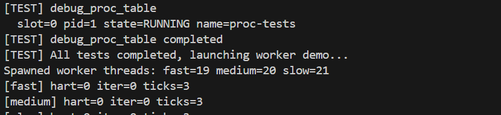
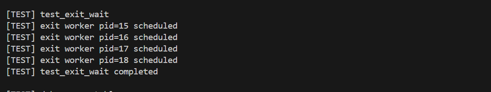
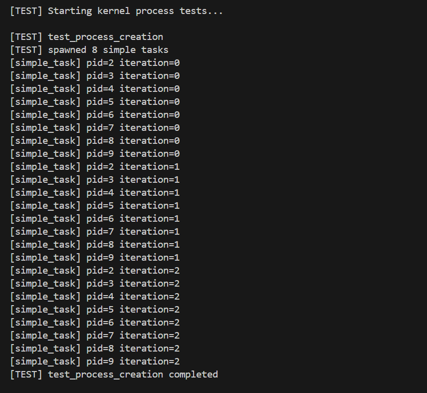
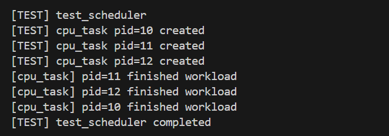
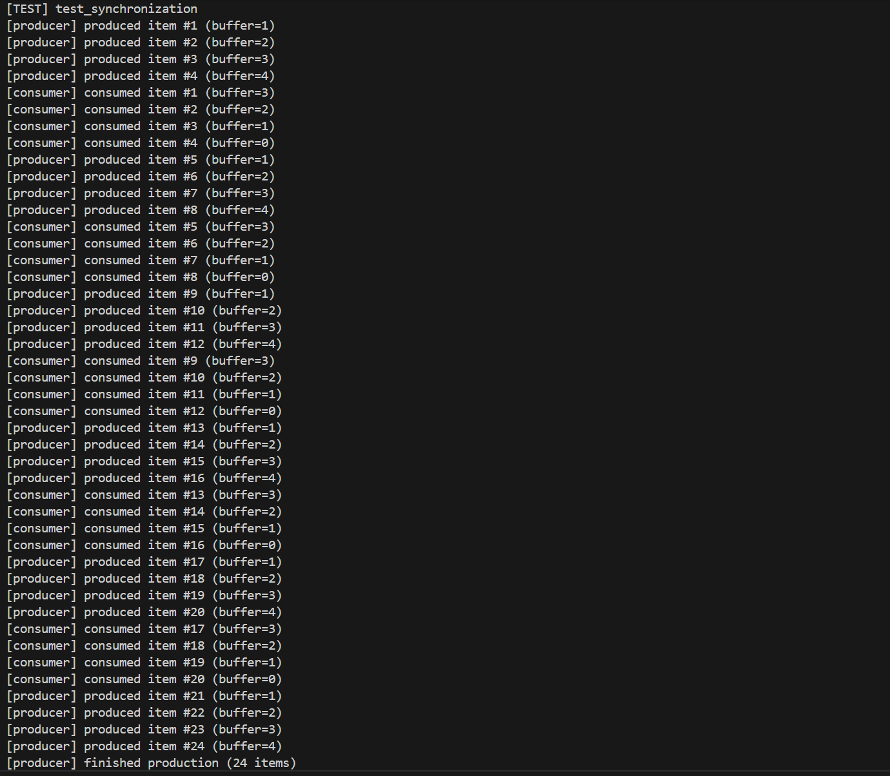

# 综合实验报告lab5 —— 进程管理与调度

## **系统设计**

- **架构设计说明**：
  - 项目实现为内核级“内核线程”调度子系统，主要模块及职责：
    - **`kernel/proc/proc.c`**：进程表、PID 分配、进程生命周期（创建、运行、退出、回收）、调度器 `scheduler()`。
    - **`kernel/proc/swtch.S`**：保存/恢复寄存器的上下文切换汇编实现（`s0~s11`, `ra`, `sp` 等）。
    - **`kernel/trap/trap_kernel.c`**：时钟中断处理，递增 `ticks` 并在 Hart0 上触发 `yield()` 实现抢占。
    - **`kernel/boot/main.c`**：引导与测试驱动，启动内置测试进程 `run_all_tests()` 并在测试后启动 worker demo。

- **项目目录**:
```
whu-oslab-lab5/
├── Makefile / common.mk
│   ├── 构建入口：交叉编译、链接、生成 kernel-qemu
│   └── 常用目标：make / make qemu / make clean
│
├── kernel/                           # 内核源码（S-mode 为主，含少量 M-mode 启动/定时器）
│   ├── kernel.ld                     # 链接脚本：段布局、符号导出
│   │
│   ├── boot/                         # 启动链路：从 entry 到进入 scheduler
│   │   ├── entry.S                   # 最早入口：栈/基础环境
│   │   ├── start.c                   # M-mode 早期初始化、委托、定时器初始化、mret 到 S-mode
│   │   └── main.c                    # 内核主函数：初始化各子系统、创建/演示进程(内核线程)、进入调度器
│   │
│   ├── proc/                         # 进程管理与调度（Lab5 重点）
│   │   ├── proc.c                    # proc_table/状态机/create/exit/wait/yield/sleep&wakeup/scheduler
│   │   └── swtch.S                   # 上下文切换：保存/恢复 context（被 scheduler 调用）
│   │
│   ├── trap/                         # trap 框架：异常/中断入口与分发
│   │   ├── trap.S                    # trap 入口向量：保存现场→调用 C→恢复→sret
│   │   └── trap_kernel.c             # 中断/异常处理与分发（为时钟 tick、抢占/让出等提供支撑）
│   │
│   ├── dev/                          # 设备驱动
│   │   ├── uart.c                    # 串口 16550：输出/输入/中断
│   │   ├── plic.c                    # PLIC：外部中断 claim/complete
│   │   ├── timer.c                   # 定时器：tick 维护（调度/时间片的时钟来源）
│   │   └── console.c                 # console 抽象（通常薄封装 UART）
│   │
│   ├── mem/                          # 内存管理（实验继承/复用）
│   │   ├── pmem.c                    # 物理页分配/释放（进程栈、页表等都依赖它）
│   │   └── vmem.c                    # Sv39 页表/映射、启用分页
│   │
│   └── lib/                          # 基础库
│       ├── print.c                   # printf/panic
│       ├── spinlock.c                # 自旋锁（proc/irq 关键同步原语）
│       └── string.c                  # memset/memcpy 等
│
├── include/                          # 头文件接口（与 kernel 子系统一一对应）
│   ├── proc/ (proc.h, cpu.h)         # struct proc/context/cpu + 调度/进程 API 声明
│   ├── trap/ (trap.h)                # trap 相关结构/接口
│   ├── mem/ (pmem.h, vmem.h)         # 内存接口
│   ├── dev/ (uart.h, plic.h, ...)    # 设备接口
│   ├── lib/ (lock.h, print.h, ...)   # 锁/输出/字符串接口
│   ├── riscv.h / memlayout.h / common.h
│   └── CSR/位定义、地址布局、基础类型与宏
│
├── README.md / Report.md             # 说明与实验报告
├── picture/                          # 实验截图
├── 操作系统实践PPT-进程管理与调度.pdf  # 实验资料
├── 从零构建操作系统-学生指导手册.(pdf/docx) # 参考资料
└── kernel-qemu / kernel.bin          # 构建产物（可执行镜像/裸二进制）
```

- **关键数据结构**：
  - `struct context` (`include/proc/proc.h`): 保存上下文寄存器，用于 `swtch()` 的保存与恢复。
  - `enum proc_state` (`include/proc/proc.h`): 进程状态集合：`UNUSED`, `SLEEPING`, `RUNNABLE`, `RUNNING`, `ZOMBIE`。
  - `struct proc` (`include/proc/proc.h`): 记录 PID、父进程指针、进程名、内核栈基址、`struct context`、退出码等元数据。
  - `struct cpu` (`include/proc/proc.h`): 每个 hart 的当前进程与调度器上下文（`cpu.ctx`），支持 `mycpu()` / `myproc()`。
  - `proc_table[NPROC]` (`kernel/proc/proc.c`): 固定大小的进程表，调度通过线性扫描查找 `RUNNABLE` 条目。

- **与 xv6 对比分析**：
  - 功能范围：本实现聚焦于内核线程（kernel threads），不涉及用户态地址空间、系统调用、文件系统等；因此实现更精简。
  - 调度策略：采用与 xv6 类似的简单轮转（round-robin）策略，遍历 `proc_table` 寻找 `RUNNABLE` 进程并切换。
  - 抢占机制：通过时钟中断驱动 `yield()`，与 xv6 的抢占模型基本一致，但本实验在设计上仅在 Hart0 上维护 tick 和主要调度逻辑，Hart1 做 idle 处理以简化实验观察。

- **设计决策理由**：
  - 先实现内核线程（kernel threads），确保上下文切换与抢占正确，再扩展到用户态，降低实现复杂度与调试成本。
  - 将 tick 更新与主要调度逻辑集中在 Hart0，便于观测与复现调度行为。
  - 集成测试驱动 `run_all_tests()`，通过进程形式依次运行测试用例，确保实现的可验证性与复现性。

## **实验过程**

- **实现步骤记录**：
  1. 在 `include/proc/proc.h` 中定义并校准 `struct context`、`struct proc`、`struct cpu`，保证与 `swtch.S` 的寄存器保存顺序一致。
  2. 在 `kernel/proc/proc.c` 中实现基本接口：`proc_init()`、`alloc_proc()`/`create_process()`、`exit_process()`、`wait_process()`、`yield()`、`scheduler()`。
  3. 在 `kernel/trap/trap_kernel.c` 中的时钟中断处理里调用 `timer_update()` 并在 Hart0 上触发 `yield()`，实现抢占。
  4. 在 `kernel/boot/main.c` 中实现 `run_all_tests()`，包含 `test_process_creation`、`test_scheduler`、`test_synchronization`、`debug_proc_table` 等测试函数，测试通过后启动三个 worker（fast/medium/slow）进行演示。
  5. 调整日志与打印频率，避免输出刷屏，加入 `[TEST]` 前缀便于日志过滤。

- **遇到的问题与解决方案**：
  - 上下文切换后寄存器值异常（寄存器破坏/返回异常）。
    - 问题：进程恢复后寄存器值错误、返回地址错乱或立即崩溃。 
    - 成因：`struct context` 与 `swtch.S` 中保存/恢复寄存器顺序/字段不一致以及 `swtch.S` 保存的寄存器集合不完整。 
    - 解决：确保 `include/proc/proc.h` 中 `struct context` 字段顺序严格对应 `kernel/proc/swtch.S` 中的保存顺序。

  - sleep/wakeup 无效（进程一直阻塞或无法被唤醒）。
    - 症状：被 `sleep(chan)` 的进程不再变成 `RUNNABLE`，或 `wakeup(chan)` 没有效果。 
    - 成因：睡眠/唤醒使用的 channel 不一致、在未持锁的情况下修改状态或错把 `wakeup` 调用了错误的条件分支。 
    - 解决：确保 `sleep()` 在持有相应锁时变更状态并释放锁后调用 `sched()`，`wakeup()` 在持锁时扫描并改状态；检查 `kernel/proc/proc.c` 中 `sleep`/`wakeup` 实现与使用处的 channel 参数。

  - 进程创建后立即退出或未运行（trampoline/entry 问题）。
    - 症状：创建日志显示 PID 已分配但没有看到运行日志或很快变为 `ZOMBIE`。 
    - 成因：入口函数 `proc_trampoline()` 或传入函数指针/参数设置错误，或内核栈/上下文初始化不完整。 
    - 解决：在 `create_process()` 路径插入临时打印，验证 `context->ra`/`sepc`/`sp` 等是否正确。 确保 `proc_trampoline()` 能正确调用传入函数并在返回后调用 `exit_process()`。

- **源码理解总结**：
  - `swtch()`（`kernel/proc/swtch.S`）负责保存当前进程的一组 callee-saved 寄存器并加载目标进程寄存器，C 代码只需维护 `struct context`。
  - `scheduler()` 作为每个 `cpu` 的内核调度循环（在 `cpu.ctx` 上运行），通过遍历 `proc_table` 寻找 `RUNNABLE` 进程并调用 `swtch()` 切换到该进程；进程返回后由 `scheduler()` 继续循环。
  - 新进程通过 `proc_trampoline()` 或类似的入口统一执行传入函数，函数返回后调用 `exit_process()` 完成清理与回收。

## **测试与验证**

- **功能测试结果**：
  - `test_process_creation`：成功创建并回收多个 `simple_task`，PID 分配与回收正常；日志显示进程创建、运行、退出序列。
  - `test_scheduler`：不同 CPU 工作强度任务（fast/medium/slow）在 Hart0 上被轮流调度，时钟中断能触发抢占切换。
  - `test_synchronization`：使用 `spinlock` 实现的生产者-消费者测试通过，`produced_total == consumed_total`。
  - `debug_proc_table`：可以打印进程表中每个 slot 的状态（`UNUSED`/`RUNNABLE`/`RUNNING`/`ZOMBIE`），用于确认进程生命周期转换正确。

- **性能数据**：
  - 采集方法：在 QEMU 中运行 `make qemu`（或 `make qemu-gdb`），观察内置测试日志并记录各 worker 的 `iter` 与 `ticks` 值。
  - 推荐命令：
    ```bash
    make
    make qemu         # or `make qemu-gdb` for debugging
    ```

- **运行截图 / 录屏（说明与占位）**：
进程状态调试输出：

进程退出与等待测试：

进程创建测试：

调度器测试：

同步机制测试（消费者与生产者）：

Worker demo 运行截图：


## **结论与后续工作**

- 实验达成：实现了内核线程级别的进程管理与抢占式轮转调度，关键函数（`create_process`、`exit_process`、`wait_process`、`yield`、`scheduler`）已实现并通过内置测试验证。
- 后续建议：
  - 引入 `sleep/wakeup`，将 `wait_process` 从忙等改为事件驱动以降低 CPU 空转。
  - 添加优先级或多级反馈队列，提升调度策略以适配差异化负载。
  - 扩展到用户态进程，加入页表与系统调用框架，完成更完整的操作系统功能链路。

---

## **思考题与解答**

1. 进程模型：
   - 为什么选择这种进程结构设计？
     - 选择以内核线程（kernel threads）为主的设计，可以把注意力集中在上下文切换、调度与同步上，而不引入用户态地址空间、页表与系统调用的复杂性，便于实验验证与调试。
     - 结构简单、实现成本低，符合实验教学目标：先保证调度正确，再扩展功能。
   - 如何支持轻量级线程？
     - 实现独立的线程控制块（TCB）和内核栈，但共享进程级资源（如地址空间、文件表），线程创建使用类似 `thread_create()` 的接口，避免复制整个地址空间。
     - 使用较小的创建/销毁开销（例如不走完整 `fork()` 路径），提供轻量级同步原语（自旋锁/互斥）和线程局部数据。

2. 调度策略：
   - 轮转调度的公平性如何？
     - 轮转（round-robin）在相同时间片下对所有可运行任务提供时间公平性，但对 I/O 密集型与 CPU 密集型任务的感知不足，也无法保证实时约束或优先级区分。
     - 实际公平性还依赖时间片长度、遍历顺序与中断触发频率；短时间片提升响应但增加上下文切换开销。
   - 如何实现实时调度？
     - 引入优先级队列或实时调度算法（如 RMS、EDF），将实时任务放入独立的调度通路，并保证优先级可抢占。
     - 需要支持优先级继承、时间预算/带宽限制，以及在内核中减少长不可抢占区间以满足延迟约束。

3. 性能优化：
   - `fork()` 的性能瓶颈如何解决？
     - 采用 Copy-On-Write（COW）机制，延迟页面复制直到写时，避免在 `fork()` 时立即复制整个地址空间。
     - 提供 `vfork()` 或 `posix_spawn` 等更轻量的创建接口，并对大对象使用懒分配/映射策略。
   - 上下文切换开销如何降低？
     - 减少不必要的切换（增大时间片或使用协作式调度点），在汇编层只保存必要寄存器，减少保存/恢复工作量；优化锁设计以降低争用。
     - 使用 per-CPU 数据结构 和 本地缓存来降低跨核同步成本，必要时采用批量切换或用户态线程方案减少内核切换频度。

4. 资源管理：
   - 如何实现进程资源限制？
     - 在内核中对每类资源做计量（内存、文件描述符、CPU 时间等），并在分配点检查配额；提供类似 `ulimit` / cgroups 的接口以配置和执行限制。
   - 如何处理进程资源泄漏？
     - 使用引用计数、统一的资源释放路径（on-exit cleanup），并在退出路径中确保释放所有分配；增加内核诊断（日志/统计）和定期清理线程（reclaimer）。

5. 扩展性：
   - 如何支持多核调度？
     - 使用 per-core runqueue 与轻量锁（或无锁结构），在每核上运行本地调度器以减少全局争用；保留全局或分区式调度器以处理全局策略。
   - 如何实现负载均衡？
     - 定期收集每核负载信息并进行任务迁移（work-stealing 或主动迁移），考虑亲和性与缓存热度，迁移策略需权衡迁移成本与负载均衡收益。
