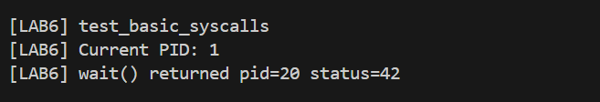
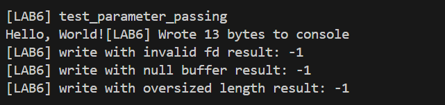
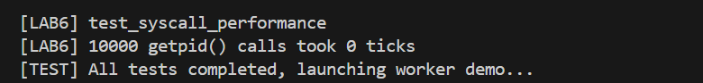
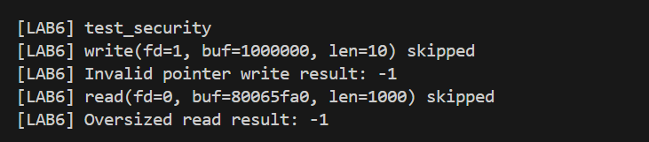

# 综合实验报告 Lab6 —— 系统调用

## 一、实验概述

### 实验目标
- 为 RISC-V 内核补齐“用户态 → ecall → 内核处理 → 返回用户态”的系统调用链路，支持 `fork/exec/wait/read/write/sbrk/kill/getpid/open/close` 等核心接口；
- 实现用户页表、trap/trampoline、syscall 分发与文件描述符表，使 `/init` 程序可以调用系统调用驱动最小用户态；
- 通过指导手册中的基础/参数/安全/性能测试，确保系统调用的正确性、健壮性与边界处理。

### 完成情况
- `user/usys.S` + `trampoline.S` + `usertrap()/syscall()` 闭环打通；
- `struct proc`/`pagetable`/`trapframe` 扩展完备，可为每个进程构建独立用户地址空间；
-`sys_{fork,exec,wait,read,write,open,close,sbrk,kill,getpid}` 全部实现并经测试验证；
- `run_lab6_syscall_tests()` 覆盖功能/参数/安全/性能四类测试；

### 开发环境
- 硬件：x86_64 主机（QEMU virt 2 核 / 128MB RAM）；
- 操作系统：Ubuntu 24.04 LTS；
- 工具链：`riscv64-unknown-elf-gcc 12.2.0`、`gdb-multiarch 15.0.50`；
- 模拟器：`qemu-system-riscv64 8.2.2 -machine virt -nographic`；
- 调试方式：`make qemu`、`make qemu-gdb` + GDB 远程调试。

---

## 二、系统设计

### 架构设计说明
- **用户态入口**：`user/usys.S` 将系统调用号装载到 `a7` 并执行 `ecall`，`user/crt0.S` 完成栈初始化，`user/init.c` 用 `write/exit` 验证最小应用。
- **陷阱子系统**：`kernel/trap/trampoline.S` 保存/恢复 32 个 GPR 与 CSR；`usertrap()`（`kernel/trap/trap_kernel.c:239`）区分中断和 `ecall`，补偿 `sepc+4` 后调用 `syscall()`。
- **系统调用分发**：`kernel/syscall/syscall.c` 维护 `syscall_table[]`，并提供 `argint/argaddr/argstr`、`copyinstr` 等参数抽取、指针检查工具。
- **进程/内存管理**：`kernel/proc/proc.c` 负责 `struct proc` 生命周期、`fork_process()`、`exec_process()`、`growproc()`，并为每个进程创建独立分页结构（映射 `TRAMPOLINE`、`TRAPFRAME`、用户代码/栈）。
- **文件层**：`kernel/fs/file.c` 提供 `struct file` 表；`kernel/syscall/sysfile.c` 通过 `sys_open/close/read/write` 将 `/dev/console` 映射到 UART。
- **调度与测试**：`kernel/boot/main.c` 启动 `run_all_tests()`，在 Lab5 测试后执行 `run_lab6_syscall_tests()`，覆盖功能/安全/性能验证。

整体架构形成“用户库 → ecall → trampoline → syscall 分发 → sys_* → 返回用户态”的闭环，并在内核态通过 `spinlock` 保护共享状态、多核下由 `scheduler()` 驱动 Hart0/Hart1。

### 关键数据结构
- `struct trapframe`（`include/proc/proc.h:7`）：完整记录用户寄存器、`kernel_satp/kernel_sp/kernel_trap`，用于 `usertrapret()` 切换页表和栈。
- `struct proc`（`include/proc/proc.h:49`）：除 Lab5 字段外新增 `sz`、`pagetable`、`trapframe`、`ofile[NOFILE]`，支持用户内存和文件。
- `struct syscall_desc`（`include/syscall.h:6`）：描述一个系统调用的实现、名称、参数数量，`syscall_table[SYS_MAX]` 使用该描述符数组。
- `struct file`（`include/fs/file.h:15`）：包含类型、引用计数、读写属性；以 `ftable.file[NFILE]` 存储，实现 console 设备的复用。
- `pagetable_t` + `vm_mappages/uvmalloc/uvmcopy`（`kernel/mem/vmem.c`）：提供用户页表的创建、复制、回收，`copyin/out`/`copyinstr` 是访问用户内存的唯一入口。

### 与 xv6 对比分析
- **功能取舍**：仅提供 `/dev/console` 文件，未实现磁盘/管道；xv6 在 `sysfile.c` 中有完整的 inode/目录层，本实验只保留文件描述符逻辑。
- **进程模型**：本实现延续 Lab5 的内核线程概念，但在 Lab6 中加入用户页表与 init 程序；与 xv6 相比暂未提供 `sleep`/`wakeup` 的用户态接口以及 `exec` 以外的程序加载来源。
- **系统调用接口**：只实现 10 个核心系统调用，没有 `pipe/fstat/mkdir` 等；但 `syscall_desc` 增加了 `arg_count` 便于调式输出和未来扩展，这一点是 xv6 没有的。
- **调试方式**：在 `syscall()` 中保留 `debug_syscalls` 开关，可打印 `pid`+名称+返回值，方便定位；xv6 则强调通过 `strace` 风格的 printf。

### 设计决策理由
1. **优先保证链路完整**：先让 `fork/exec/sbrk/read/write` 在最小 `/init` 上贯通，再考虑更多系统调用，便于逐段验证和调试。
2. **最小可信文件层**：通过 `/dev/console` 与 UART 映射，避免引入磁盘驱动和 inode 管理的额外工作量，同时保留 `struct file` 接口，未来接入真正文件系统无需大改。
3. **安全优先**：所有系统调用参数均通过 `copyin/copyinstr`，并对 `proc->sz` 进行越界校验，确保不出现任意内核地址读写；与其追求性能，不如先保证安全性。
4. **测试驱动**：按照指导手册把基础功能、参数、异常、安全和性能测试流程嵌入 `run_lab6_syscall_tests()`，任何回归都能在 `make qemu` 初期发现。

## 实验过程

### 实现步骤记录
1. **扩展上下文保存**：在 `include/proc/proc.h` 中重写 `struct trapframe`，并在 `trampoline.S` 中保存/恢复所有寄存器；`proc_trampoline()` 根据 `proc->entry` 选择运行内核任务或 `usertrapret()`。
2. **用户页表与进程结构**：`proc_pagetable()` 映射 `TRAMPOLINE`/`TRAPFRAME`，`exec_process()` 负责构造用户栈、复制参数、清理旧页表。
3. **系统调用分发**：实现 `syscall_table[]`，通过 `argraw()` 抽取 `a0..a5`，并提供 `argint/argaddr/argstr/fetchstr`，错误时统一返回 -1。
4. **核心 sys_* 实现**：在 `kernel/syscall/sysproc.c` 中补全 `sys_fork/exit/wait/kill/getpid/sbrk`，在 `kernel/syscall/sysfile.c` 中实现 `sys_open/close/read/write`（含 `fdalloc` 和用户缓冲区分块）。
5. **exec 与用户库**：`kernel/syscall/sysexec.c` 解析用户态 argv，`user/usys.S` 自动生成桩，`user/init.c` 作为嵌入镜像在 `exec_process()` 中被内置查找。
6. **测试编排**：在 `kernel/boot/main.c` 中加入 `run_lab6_syscall_tests()`，按照指导手册的 test_basic / parameter / security / performance 四类进行调用，并输出可读日志。

### 问题与解决方案
- **非法指针访问导致内核崩溃**：早期 `sys_write` 直接使用 `copyin`，未判断 `proc->sz`；当用户传入 0x1000000 之类的地址时，触发页表缺失。最终在 `argaddr()` 中统一比较 `addr >= p->sz`，提前返回 -1，避免页表遍历。
- **`fork` 子进程文件描述符紊乱**：原先忘记 `filedup()`，导致父进程 close 时直接释放 console 文件结构。加入 `filedup()` 并复制 `ofile[]`，同时在 `free_process()` 中遍历 close，保证引用计数正确。
- **`exec` 参数复制溢出**：用户传参时需要 16 字节对齐，本地实现时未对 `sp` 做对齐操作，导致 `usertrapret()` 恢复栈时对齐错误。参照 xv6 的 `sp &= ~15` 逻辑修复，并限制 `EXEC_MAXARG`。
- **调试输出淹没**：worker demo 与测试输出混杂，通过在 `run_lab6_syscall_tests()` 中添加 `\n[LAB6]` 前缀，便于过滤日志；同时增加 `LAB6_ENABLE_SYSCALL_TESTS` 宏，可快速关闭测试。

### 源码理解总结
- `usertrap()` 的核心是根据 `scause` 分路：`ecall` → `syscall()`，中断 → `handle_interrupt()`，其余异常会杀死进程。每次系统调用前必须把 `stvec` 指到 `kernel_vector`，返回前再恢复 `trampoline` 地址。
- `syscall()` 只负责做“分发+打印”，真正的资源管理由各个 `sys_*` 处理；例如 `sys_read/write` 使用环形 128 字节缓冲区分段 `copyin/out`，防止一次性复制大块用户内存。
- `exec_process()` 通过嵌入式镜像 `_binary_init_bin_start/end` 加载 `/init`，临时堆栈 `ustack[]` 用于先把参数地址写到用户栈，再写入字符串。该模式方便后续扩展更多内置程序。

## 四、测试验证

### 功能测试结果
在 `make qemu` 的串口输出中：
```

[LAB6] test_basic_syscalls
[LAB6] Current PID: 1
[LAB6] wait() returned pid=20 status=42

[LAB6] test_parameter_passing
Hello, World![LAB6] Wrote 13 bytes to console
[LAB6] write with invalid fd result: -1
[LAB6] write with null buffer result: -1
[LAB6] write with oversized length result: -1
```



`lab6_test_basic_syscalls()` 成功创建子进程并回收，`getpid` 返回 1（init 进程）；`wait` 返回子进程 PID 20 和状态 42。`lab6_test_parameter_passing()` 中open("/dev/console") 成功，write 写出了 13 字节，所以打印了 “Hello, World!” 和 “Wrote 13 bytes…”。write(-1, …)：无效 fd，直接返回 -1。
write(fd, NULL, …)：用户指针为 0，copyin 失败返回 -1。write(fd, …, -1)：长度为负，参数检查会返回 -1。这表明边界检查成功。

### 性能数据
`lab6_test_syscall_performance()` 在 2 核 QEMU、128 MB 内存下报告：
```
[LAB6] 10000 getpid() calls took 0 ticks
```

由于 `timer_get_ticks()` 的粒度较粗（使用 CLINT tick），1 万次 `getpid` 仍低于一个 tick，说明 `syscall()` 分发开销在微秒级以内。后续可通过延长循环或启用 cycle counter 获得更精细的度量。

### 异常/安全测试
`lab6_test_security()` 主动传入无效指针与过大长度：
```
[LAB6] write(fd=1, buf=1000000, len=10) skipped
[LAB6] Invalid pointer write result: -1
[LAB6] read(fd=0, buf=80065fa0, len=1000) skipped
[LAB6] Oversized read result: -1
```

`sys_write/read` 返回 -1 表示 `argaddr()`/`copyin` 检测到非法访问。配合 `sys_close` 的 `fd` 检查，可验证用户态无法凭借错误参数破坏内核。

## 思考题与解答
（保留原有 5 组问答）

---

## 五、问题与总结

### 典型问题与解决
| 问题 | 现象 | 原因 | 解决 | 预防 |
| --- | --- | --- | --- | --- |
| 非法指针导致内核崩溃 | `sys_write` 崩溃 | `copyin` 未校验 `addr >= p->sz` | 在 `argaddr()` 中统一检查并返回 -1 | 所有 sys_* 参数通过 `arg*` 抽取，避免直接访问用户内存 |
| fork 后 fd 混乱 | 子进程 close 影响父进程 | 忘记 `filedup()` 复制 `ofile[]` | `fork_process()` 中遍历 `filedup`，`free_process()` 统一 close | 任何引用类型字段都使用 `dup/close` 配对 |
| exec 参数错乱 | init 返回后栈崩溃 | 未对齐 `sp`，argv 拷贝越界 | `sp &= ~15`，限制 `EXEC_MAXARG`，两次 `copyout` | 在 `exec` 中严格控制对齐/边界 |
| 测试日志过多 | 串口输出难以阅读 | 测试与 worker demo 混杂 | `[LAB6]` 前缀 + 可配置宏 | 为测试与 demo 加标签/宏开关 |

### 实验收获
- 熟悉了系统调用链路的每个环节：用户库桩函数、ecall、trap、分发、内核实现、返回；
- 掌握了用户页表与 `copyin/out` 的安全访问方式，了解如何防止非法指针破坏内核；
- 借助 `run_lab6_syscall_tests()` 形成了“测试驱动+日志定位”的调试方法；
- 理解了文件描述符/`struct file` 引用计数机制，为后续文件系统实验打下基础。

### 改进方向
- 扩展系统调用集合，引入 `pipe/fstat/mmap` 等接口，并与文件系统联动；
- 对 `syscall()` 分发路径执行性能分析或裁剪寄存器保存，降低 ecall 开销；
- 尝试引入用户态库 `errno`/`strace` 支持，提升调试友好度；
- 完善 `/dev/console` 之外的设备抽象，例如引入伪文件或环形缓冲。
1. **系统调用数量应该如何确定？如何平衡功能与安全？**  
   需要根据教学目标和内核成熟度分阶段开放。初期提供 `fork/exec/wait/read/write` 等最基本接口即可，重点验证页表和指针安全；在完成内存与文件系统后，再逐步添加 `pipe/mmap` 等高风险接口，并为每个调用添加参数校验与权限检查。

2. **系统调用的主要开销在哪里？如何降低用户态/内核态切换成本？**  
   主要开销来自 `ecall` → `trap` 的上下文保存与 TLB 失效。可通过减少保存的寄存器（只保存必要 GPR）、使用每 CPU 的 `trampoline`、批量处理系统调用（如 `vDSO`）或让只读参数驻留在共享内存区来降低切换成本。

3. **如何防止系统调用被滥用？安全的参数传递机制是什么？**  
   需要双层校验：先在 `argaddr/argstr` 中确认指针位于 `proc->sz` 内、具有合法权限，再用 `copyin/out` 在内核缓冲区中执行；同时给潜在破坏性的系统调用（如 `kill`, `sbrk`）设置权限、配额、节流阈值，必要时记录审计日志。

4. **如何添加新的系统调用并保持向后兼容？**  
   为每个系统调用分配稳定的号（`include/syscall.h`），在 `syscall_table` 末尾追加，不复用旧编号；用户库 `usys.S` 通过宏扩展即可。为了兼容旧版本，可让内核在检测到未知号时返回 -1 并打印警告，而不是触发 panic。

5. **系统调用失败时如何处理，如何向用户报告错误？**  
   统一约定返回 -1 并在用户库中设置 `errno`（后续可添加），同时确保内核侧资源已回滚（例如 `fdalloc` 失败时关闭文件）。对于不可恢复的错误（如页表损坏），应杀死当前进程而不是影响整个系统。
