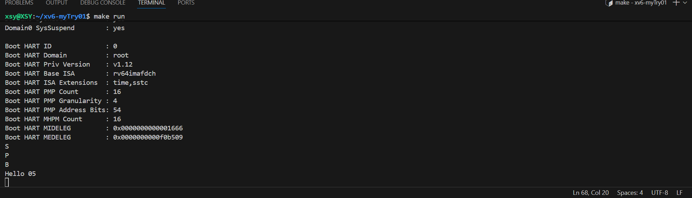

# 实验报告（实验 1：RISC-V 引导与裸机启动）

## 一、实验目的

通过参考 xv6 的启动机制，理解并实现最小操作系统的引导过程，最终在 QEMU 中输出 `"Hello 05"`。  

具体目标：
1. 掌握 RISC-V 裸机启动流程。  
2. 学会编写启动汇编、链接脚本。  
3. 理解 BSS 段清零、栈初始化的重要性。  
4. 实现最小串口驱动并输出字符串。  
5. 熟悉 QEMU + GDB 调试方法。  

## 二、实验环境

  硬件：x86_64 主机  
  软件：  
    QEMU (支持 RISC-V virt)  
    RISC-V GNU 工具链 (`riscv64-unknown-elf-gcc`)  
    GDB (`gdb-multiarch`)  
  系统：Ubuntu 24.04  

## 三、实验内容与步骤

### 1. 启动流程分析
参考 xv6 的 `entry.S`、`kernel.ld` 等，理解：
    `_start` 入口设置栈指针。  
    BSS 清零，保证全局变量为 0。  
    跳转到 C 函数继续执行。  
    链接脚本定义内存布局（`0x80000000` 起始地址）。  

### 2. 启动流程设计
    栈放置：在 `.bss` 段之后，大小 4KB。  
    BSS 清零：必要，否则全局变量可能随机值。  
    串口输出：使用内存映射 UART (0x10000000)。  
    流程图链：QEMU Reset → _start (entry.S) → 栈初始化 → 清零 BSS → 调试点输出 (S / P / B)
    → 跳转到 main (C 代码)
    → UART 输出 "Hello 05"
    → 死循环  

### 3. 代码实现
#### (1) `entry.S`
    设置栈，清零 BSS，增加调试点输出 S/P/B ，跳转到 `main`。 

#### (2) `kernel.ld`
    设定入口地址为 `0x80000000`，定义 `.text`、`.data`、`.bss`段，定义 `stack_top` 符号。  

#### (3) `uart.c`
    实现 `uart_putc` 和 `uart_puts`，用 MMIO 而非 PMIO 访问 UART。  

#### (4) `main.c`
    调用 `uart_puts("Hello 05\\n");`  
    死循环防止退出。  

### 4. 调试方法(README.md)
1. 调试点字符输出：  
   `S`：进入 `_start`。  
   `P`：栈初始化完成。  
   `B`：BSS 清零完成。  
   `Hello 05`：C 函数执行成功。  

2. QEMU GDB 调试：
   `make qemu-gdb` → QEMU 挂起。  
   `gdb-multiarch kernel.elf` → GDB 加载符号。  
   `target remote :1234` → 连接。  
   `b _start`、`b main` → 设置断点。  
   `si` 单步执行汇编。  

### 5. 实验结果截图
    运行make run后终端输出：

### 6. 实验思考
    考虑到函数调用深度，我采用4kb大小的栈。若溢出，可能会造成程序崩溃，可在栈底添加一个魔数。BSS段如果不清零，全局变量的值是随机的，除非每一个全局变量均进行了初始化。
与xv6其支持多核，中断以及内存管理等，但是在lab1中支持单核，串口输出。

## 四、 实验总结

    通过本实验，我掌握了 RISC-V 裸机启动流程，学会了如何从 _start 设置栈、清零 BSS，再跳转到 C 函数，并通过串口打印输出验证结果。使用 QEMU + GDB，可以精确调试每一步。
最终成功实现最小 OS 输出 "Hello 05"。
    其中遇到了一些问题，比如我没注意到entry.S文件名后缀应该是大写的'S'，而非小写，导致在make run 中一直报错——最后通过多次询问ChatGpt解决问题。
    另外，编译过程中还遇到“编译器在生成对字符串常量 "Hello 05\n" 的访问时，尝试用 RISC-V 的 auipc+addi 模式，结果因为地址太远而失败”这类错误，因为是在裸机中，我们把程序加载在
0x80000000，而默认编译选项假设 .rodata 可能在更远的地方。故而我在链接脚本中将.rodata 紧跟 .text，地址更近，也避免 relocation 溢出。
    除此之外，在进行调试的时候也出现了一些问题如“(gdb) c The program is not being run.”，最后发现是由于输入“target remote :1234”未连接成功