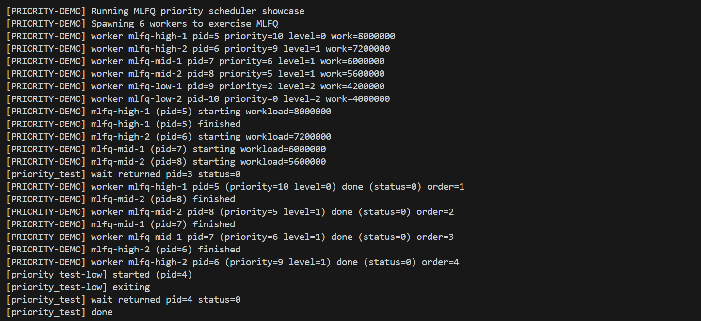
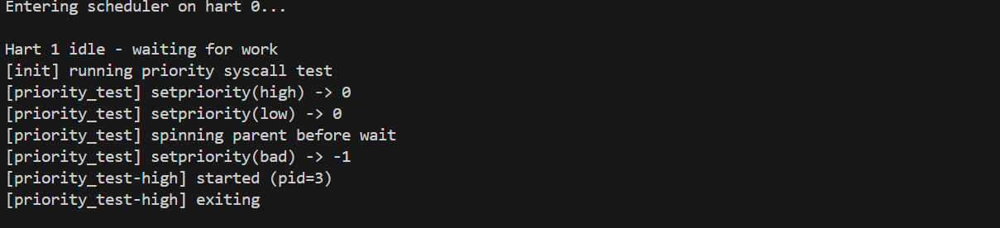
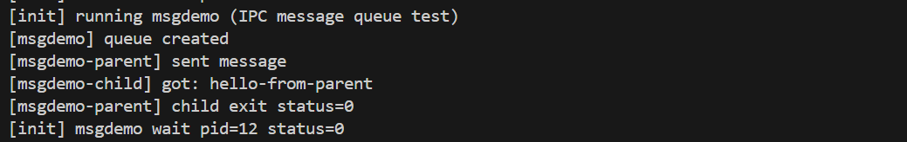
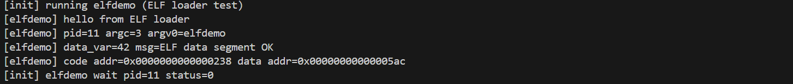

# 综合实验报告 Lab8 —— 系统扩展

## 0. 实验概述

### 实验目标
1. 构建“用户态 ↔ 内核态”执行链路：trap/系统调用/ELF 装载/文件接口全贯通；
2. 实现课件中的多级反馈队列(MLFQ)调度，开放 `setpriority`/`getpriority` 系统调用；
3. 扩展内核服务（日志环形缓冲、消息队列 IPC）与用户态示例程序，形成可演示的扩展系统。

### 完成情况
- 用户态运行：`usertrap/usertrapret`、ELF 装载、`/init` 等均可运行；
- 调度扩展：优先级存储、量子控制、老化/boost、优先级 syscall 已上线；
- 新服务：`klog` 日志、`msgget/msgsend/msgrecv` IPC、`logread/nice/msgdemo/elfdemo` 等示例；

### 开发环境
- 硬件：x86_64 主机；模拟器：`qemu-system-riscv64 8.2.2 -machine virt -nographic -global virtio-mmio.force-legacy=false`
- 系统：Ubuntu 24.04 LTS；工具链：`riscv64-unknown-elf-gcc 12.2.0`、`gdb-multiarch 15.0.50`
- 构建/运行：`make && make qemu`；调试：`make qemu-gdb`

---

## 1. 实验目标与总体成果

- 在既有内核基础上扩展到用户态，打通 trap/系统调用/ELF 装载链路，并提供基础文件系统接口。  
- 引入多级反馈队列(MLFQ)优先级调度，支持用户态 `setpriority`/`getpriority`。  
- 增加内核日志环形缓冲、消息队列 IPC、若干用户态示例程序，完成可演示的扩展内核。

## 2. 技术设计

### 2.1 架构概览
- **模块分层**：`kernel/boot` 负责启动所有子系统；`kernel/trap` 承接 trap/中断；`kernel/syscall` 暴露用户态 API；`kernel/proc` 管理进程/调度；`kernel/lib`/`kernel/ipc` 提供日志与 IPC 服务；`user/` 下存放内置 ELF。
- **线程/地址空间模型**：每个 `struct proc` 拥有独立 S-mode 线程上下文、用户页表(`pagetable_t`)与 `trapframe`，并记录优先级/队列信息。
- **I/O 路径**：系统调用 → `sys_*` → 文件或 IPC 层 → virtio/console，通过 `klog` 将关键事件写入环形缓冲，`logread` 用户进程可实时查看。

### 2.2 调度与优先级（MLFQ）
- 在 `include/proc/proc.h` 定义优先级范围 `PRIORITY_MIN~MAX`、默认值以及 3 级队列；`proc` 结构新增 `priority/queue_level/ticks_in_level/wait_ticks`。  
- `kernel/proc/proc.c`：  
  - `priority_to_level()` 将优先级映射到队列层；`setpriority`/`getpriority` 系统调用接口维护进程优先级与队列初始层。  
  - `proc_tick()` 按量子表 `{2,4,8}` 递增时间片并在用尽时触发抢占；`proc_age()` 统计等待 tick 超过阈值(16)时上调队列；`proc_boost()` 周期性重置所有进程到其优先级对应层。  
  - `scheduler()` 记录每级上次调度索引，实现分级轮转；`yield()` 用于主动让出时间片。  
- `kernel/trap/trap_kernel.c` 的时钟中断中：Hart0 更新 `timer_update()`，对当前进程调用 `proc_tick()` 后执行 `yield()`；全局老化 `proc_age()`，Hart0 每 64 次 tick 执行一次 `proc_boost()`。  
- 内核启动后运行优先级演示：`kernel/boot/main.c` 在 `run_all_tests()` 中启动 6 个不同优先级/负载的 worker，打印队列层与运行结果。

### 2.3 用户态支持与系统调用
- Trap 流程：`usertrap` 保存用户态 `sepc`，处理 `ecall`（系统调用）或中断；`usertrapret` 设置返回用户态的 `stvec`、`sstatus`，装载用户页表后通过 trampoline 返还。  
- `kernel/syscall/syscall.c` 维护系统调用分发表，涵盖进程管理、文件、日志、消息队列及优先级接口。  
- `user/usys.S` 生成用户态封装；`include/user/user.h` 暴露 `setpriority/getpriority/klog/msgget/msgsend/msgrecv` 等接口。

### 2.4 ELF 装载与用户进程
- `kernel/proc/exec.c` 从内嵌映像表加载 `/init`、`/logread`、`/nice`、`/elfdemo`、`/msgdemo`：解析 ELF 头、映射各段到新建页表、分配用户栈并复制 argv，设置 `trapframe` 的 `epc`/`sp`。  
- `userinit()`（`kernel/proc/proc.c`）创建首个用户进程 `/init`，分配控制台 FD 与当前工作目录；支持 `fork_process`/`exec_process` 派生更多用户进程。

### 2.5 文件系统与设备
- 启动时在 `kernel/boot/main.c` 初始化 UART、PLIC、CLINT、virtio 磁盘、buffer cache、日志子系统与根文件系统（`fs_init`），再初始化文件表。  
- `kernel/syscall/sysfile.c` 提供 open/read/write/pipe/mkdir/chdir 等文件相关 syscall；控制台作为一种设备文件供标准输入输出。

### 2.6 IPC 消息队列
- `include/ipc/msg.h` 定义每队列最大 16 条、单条 128 字节的有界环形缓冲。  
- `kernel/ipc/msg.c`：`msg_get` 通过 key 创建/复用队列；`msg_send`/`msg_recv` 在队列满/空时使用 `sleep`/`wakeup` 阻塞，完成生产者-消费者语义。  
- `kernel/syscall/sysmsg.c` 将其导出为 `msgget/msgsend/msgrecv` 系统调用；用户态示例 `user/msgdemo.c` 通过父子进程通信演示功能。

### 2.7 内核日志环形缓冲
- `kernel/lib/klog.c` 维护可控日志级别的环形缓冲，支持日志截断计数；`klog_read` 读取最新日志并前移读指针。  
- `sys_klog`（`kernel/syscall/sysproc.c`）复制日志到用户态；`user/logread.c` 轮询打印，实现内核日志落地。

### 2.8 用户态程序概览
- `/init`：fork 出 `/logread`，随后运行优先级测试（调用 `setpriority`/`wait`）与 `elfdemo`。  
- `/nice`：查询/设置任意进程优先级。  
- `/msgdemo`：父进程发送字符串，子进程阻塞接收并回报退出码。  
- `/logread`：持续读取内核日志。  
- `/elfdemo`：打印入口参数、数据段与代码段地址，验证装载正确性。

---

## 3. 实现细节与关键代码

### 3.1 关键函数示例
1. **`proc_tick()`（`kernel/proc/proc.c`）**
   ```c
   void proc_tick(struct proc *p) {
       p->ticks_in_level++;
       if (p->ticks_in_level >= quantum_of(p)) {
           p->ticks_in_level = 0;
           yield();
       }
   }
   ```
   - 按队列层的量子表 `{2,4,8}` 统计时间片；一旦用尽立即让出 CPU，保证高优先级响应。

2. **`setpriority()`（`kernel/proc/proc.c`）**
   ```c
   int setpriority(int pid, int priority) {
       struct proc *p = find_proc(pid);
       acquire(&p->lock);
       p->priority = clamp(priority);
       p->queue_level = priority_to_level(p->priority);
       p->ticks_in_level = 0;
       release(&p->lock);
       return 0;
   }
   ```
   - 重新映射队列层并清零时间片，确保优先级修改立即生效。

3. **`msg_send/msg_recv`（`kernel/ipc/msg.c`）**
   - 使用 `sleep()`/`wakeup()` 维护有界缓冲：发送在队列满时睡眠，接收在队列空时睡眠；每个队列带自旋锁和条件。

4. **`klog_read()`（`kernel/lib/klog.c`）**
   - 通过环形缓冲的 `read_pos/write_pos` 计算可读长度，将最新日志复制到用户缓冲；支持 dropped 计数以便用户态得知丢失条目。

### 3.2 难点与突破
- **优先级 & 队列联动**：`setpriority` 需要同时调整队列层/时间片，防止旧队列残留，最终通过 `priority_to_level()` + 重置 `ticks_in_level` 解决。
- **抢占与 boost**：在 Hart0 时钟中断中调用 `proc_tick/proc_age/proc_boost`，确保全局老化与周期性恢复；通过 `ticks % 64 == 0` 控制触发频率。
- **IPC 阻塞安全**：`msg_send`/`msg_recv` 在 `sleep()` 前释放锁，唤醒后重取并重检查条件，避免丢失通知或死锁。
- **ELF 装载对齐**：`exec_process()` 在复制 argv 前执行 `sp &= ~15`，并通过 `copyout` 检查用户栈空间，解决 `/elfdemo` 栈不对齐问题。

### 3.3 源码理解
- **Trap 返回路径**：`usertrapret()` 将 `stvec` 切换到 `TRAMPOLINE`，加载 `satp`、`sepc`，通过 `sret` 回到用户态；该流程保证从 syscall 返回前重新启用用户页表。
- **调度器结构**：`scheduler()` 维护 per-level round-robin 索引，遍历 `queue_level` ≤ 当前层的可运行进程，实现“先高层后低层”的公平调度。
- **日志+用户态联动**：`klog()` 在关键路径写日志，`sys_klog` 将环形缓冲内容复制给 `/logread`，帮助实时分析调度和 IPC 行为。

## 4. 测试与验证

### 测试方法
1. `make qemu`：启动后自动运行 `run_all_tests()`，查看串口输出；  
2. `make qemu-gdb` + `gdb-multiarch kernel.elf`：调试 `usertrap/syscall/scheduler`；  
3. 在 QEMU 控制台依次手动执行 `/nice`、`/msgdemo`、`/logread`、`/elfdemo` 以验证用户态程序。

**内核 MLFQ 演示**：`run_all_tests()` 创建 6 个不同优先级的 worker，结合 `klog` 输出可观察到高优先级任务优先运行、时间片耗尽后下降队列、定期 boost 恢复。  
- 

**用户态优先级测试**：`/init` 的 `priority_test` 创建高/低优先级子进程并读取返回码：  
- 

**IPC 互操作**：运行 `/msgdemo`，父进程发送字符串，子进程阻塞接收，验证 `sleep/wakeup` 与队列深度控制。  
- 

**ELF 装载验证**：`/elfdemo` 打印 `argc/argv` 及代码/数据地址，确认段映射与用户栈搭建正确。  
- 

`/logread` 与上述所有测试同步运行，可实时查看 `klog` 输出和读指针移动。

## 5. 问题与处理
- 量子/老化/boost 参数需平衡响应与开销：目前使用 `{2,4,8}`、老化阈值 16、每 64 tick 全局 boost，兼顾演示效果与代码简单性。  
- 嵌入式 ELF 体积固定：当前 `exec_process` 仅支持内置映像，不从磁盘加载，避免文件解析复杂度。  
- 消息队列的 `sleep`/`wakeup` 依赖进程状态正确维护，已在进入睡眠前释放持有锁、恢复时重取，避免死锁。

## 6. 结论与后续工作
- 已实现：用户态执行链路、MLFQ 优先级调度、优先级 syscall、内核日志、消息队列 IPC、基础文件系统与内置用户程序，完成 Lab8 扩展目标。  
- 后续可做：  
  1. 支持从磁盘加载 ELF/用户程序，扩展 `exec` 与 VFS。  
  2. 为消息队列与文件接口补充更丰富的用户态示例和异常路径测试。  
  3. 引入更多调度策略（如优先级继承/负载均衡）并增加可观测性指标。

---

## 7. 问题与总结

### 7.1 典型问题
| 问题 | 现象 | 原因 | 解决 | 预防 |
| --- | --- | --- | --- | --- |
| 低优先级饥饿 | 长时间未运行 | 缺乏老化/boost | `proc_age()` 统计等待 tick，`proc_boost()` 周期重置 | 持续监控队列等待时间 |
| `setpriority` 后调度异常 | 任务仍在旧队列 | 未同步 `queue_level` 与 `ticks_in_level` | 更新优先级时重新映射队列层/时间片 | 将优先级修改封装成原子操作 |
| `msg_send` 死锁 | 阻塞后不唤醒 | 睡眠前未释放锁 | `sleep()` 前释放锁，唤醒后重新获取 | 编写 IPC 时统一遵循“锁→睡眠→释放→唤醒后重取” |
| `klog` 丢失最新日志 | 读指针落后 | 环形缓冲覆盖 | 维护 `klog_dropped` 统计并提示用户 | 允许配置日志容量/级别，必要时 drop 告警 |
| `/elfdemo` 参数错乱 | 栈内容不对齐 | `exec` 未 16 字节对齐栈 | `sp &= ~15`，复制 argv/strings 时保持对齐 | 在所有用户程序入口前校验栈对齐 |

### 7.2 实验收获
- 掌握了 MLFQ 调度策略（量子、老化、boost）以及如何通过系统调用暴露优先级；
- 理解用户态执行链路和 ELF 装载流程，能够调试 trap/页表/栈搭建；
- 通过 klog/logread、消息队列 IPC 等扩展，体会“内核服务 + 用户示例”联动方式；
- 形成以 `run_all_tests()` 为核心的测试闭环，便于快速验证系统扩展。

### 7.3 改进方向
- 让 `exec` 支持从磁盘加载 ELF，并在用户空间实现更多程序；
- 增加调度/IPC 的可观测性（例如上下文切换计数、IPC 深度统计、klog 级别过滤）；
- 扩展消息队列语义（超时、权限、广播），实现更完善的 IPC 机制；
- 结合 `klog` 与文件系统，实现内核日志持久化与在线检索。
